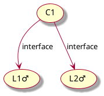
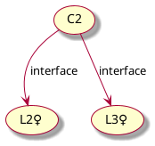
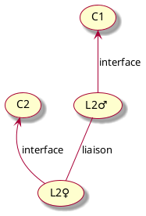
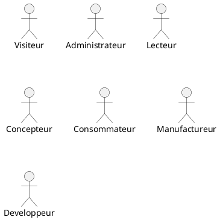
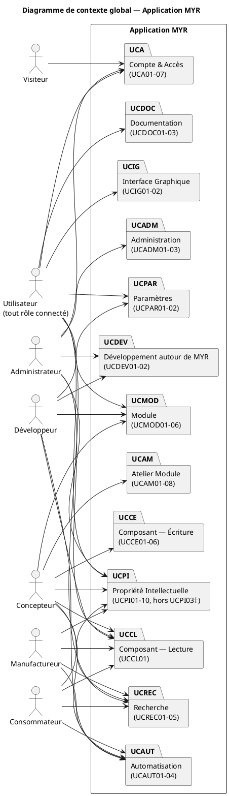
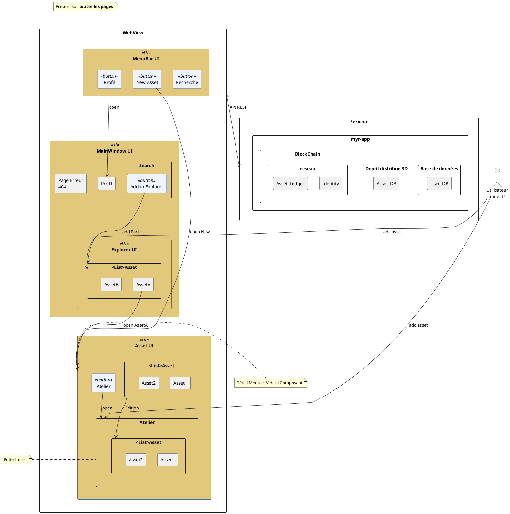

- [Terminologies](#terminologies)
  - [Asset](#asset)
  - [Composant](#composant)
  - [Module](#module)
  - [Interface](#interface)
  - [Liaisons](#liaisons)
  - [Asset d'accroche (Fastener)](#asset-daccroche-fastener)
  - [Réseau (Network)](#réseau-network)
  - [Canal (Channel)](#canal-channel)
  - [Organisation](#organisation)
  - [Atelier (Workspace)](#atelier-workspace)
  - [État draft](#état-draft)
  - [Wallet / Identité](#wallet--identité)
  - [Licence](#licence)
  - [Commission / Rémunération](#commission--rémunération)
- [1. Objectif du document](#1-objectif-du-document)
- [2. Présentation](#2-présentation)
    - [2.1. Présentation du projet](#21-présentation-du-projet)
    - [2.2. Situation actuelle](#22-situation-actuelle)
    - [2.3. Les contraintes](#23-les-contraintes)
    - [2.4. Présentation de la société](#24-présentation-de-la-société)
- [3. Acteurs](#3-acteurs)
    - [Visiteur](#visiteur)
    - [Rôle Administrateur (par défaut, immuable)](#rôle-administrateur-par-défaut-immuable)
    - [Rôle Lecteur (template)](#rôle-lecteur-template)
    - [Rôle Concepteur (template)](#rôle-concepteur-template)
    - [Rôle Consommateur (template)](#rôle-consommateur-template)
    - [Rôle Manufactureur (template)](#rôle-manufactureur-template)
    - [Rôle Developpeur (template)](#rôle-developpeur-template)
- [4. Diagramme de contexte global](#4-diagramme-de-contexte-global)
- [5. Règles métier](#5-règles-métier)
- [6. Exigences non-fonctionnelles](#6-exigences-non-fonctionnelles)
- [7. Matrice de traçabilité](#7-matrice-de-traçabilité)
- [wireframe](#wireframe)

# Terminologies

## Asset 
Actif representant un composant ou un module. il en existe 2 types :
1) Harware
   Element physique : Une pièce CAO, un produit,... 
2) Software
   Element Numérique : Logiciel, Firmware,...

Qu'il s'agisse d'un composant seul ou d'un ensemble, il est défini en differentes catégories en fonction de son évolution.

Note : On defini comme fonctionnalité, une interaction définie comme étant une interface.

Il peut-être:

- une base : à partir de rien
- une amélioration (mêmes fonctionnalités mais renforcée)
- une variation (mêmes fonctionnalités mais different)
- une adaptation (mêmes fonctionnalités sur nouvelles dimensions)
- une dérivation (Ajout de fonctionnalité)
- une extension (piece complementaire à une autre)
- une regression (on retire une fonctionnalité)
- un découpage (redécoupage d'un composant en sous-systèmes indépendants → module)

Un asset dans la blockchain possède :
- Un type (ex: base, amelioration...)
- Un Proprietaire
- une dependance (ref bloc parent)
  

## Composant
Asset ne possedant pas de sous ensemble. Un composant peut toutefois être converti en Module s'il est redécoupé en sous système. 

Représentation de 2 composants pour illustrer. les composants C1 et C2 ont chacun 2 interfaces dont un commun (compatible) à savoir L2

## Module
Asset possèdant un sous ensemble.

## Interface 

Représente les interactions possibles sur un composant. 

Chaque composant est composé d'interfaces permetant de représenter les laisons possibles entre eux. Cela permet nottament de tracer les composants compatibles ou non.

Les interfaces sont soumises aux regles suivantes:

1. La création d'un groupement de composant est défini par l'enregistrement des liaisons entre ces composants.
2. une liaison entre deux composant est représenté par une paire d'interface connectées
3. Deux mêmes composant peuvent être composées de plusieurs paires d'interfaces.
4. Une interface sur un composant ne peux pas être utilisée plusieurs fois.
5. La création d'une paire amène à une vérification de sa compatibilité.

Les interfaces d'un composant peuvent être définis de manière manuelle (utile dans le cas où l'integration ne peux pas être automatique) ou automatique (gère directement la detection des interfaces).

Chaque interface est définie selon

- une catégorie (ex : Électrique, Mécanique, Hydraulique, Numérique,...)
- un sens (Entrée, sortie ou bidirectionnel)
- un tag (Câble, connecteur, vis...)
- un type (USB-C)
- une valeur ou plage de valeur
- une unité associée (Volt, Litre, baud…)

Exemple d'interface:

- Électrique
  - Câble USB-C ♂/♀
  - Nappe IDE
  - SUB-D9 ♂/♀
  - Header 2.54mm 2×8
  - MIPI DSI Port
  - etc.
- Mécanique
  - Vis 3mm ♂
  - Trou vis 3mm ♀
  - Filetage 3mm métal ♀
  - Filetage 50mm ♂/♀
- Numérique
  - SPI (MOSI/MISO/CLK/CS)
  - I²C (SDA/SCL)
  - UART (TX/RX)
  - GPIO logique 3,3 V / 5 V
  - USB 2.0 / 3.x (protocole)
  - etc.

Exemple illustré :

## Liaisons
Représente les connexions possibles entre 2 interfaces de composants.

Une liaison peut être :
- **directe** : les deux interfaces se connectent sans intermédiaire
- **via un asset d'accroche** : un composant tiers (vis, câble, connecteur…) sert d'intermédiaire et est référencé sur la liaison

Exemple de liaison :
- Cable RJ45
- Vis
- Cable USB
- Tuyau

Une liaison dont les interfaces deviennent incompatibles après sa création n'est pas supprimée automatiquement : elle passe en état incompatible (signalée visuellement en rouge).

## Asset d'accroche (Fastener)

Composant existant sur le réseau utilisé comme intermédiaire dans une liaison (exemples : vis, câble CSI, connecteur). Son identifiant (`FastenerAssetID`) est enregistré sur la liaison. Un asset d'accroche est facultatif — une liaison peut être directe.

## Réseau (Network)

Instance isolée de la blockchain créée par un organisme ou une personne souhaitant proposer un service de traçabilité. Chaque réseau possède ses propres règles d'accès (ouvert/fermé, rôle par défaut, modération des contributions) définies par son administrateur.

Un réseau peut contenir plusieurs nœuds (serveurs) pour la gestion de la blockchain.

## Canal (Channel)

Sous-réseau logique au sein d'un réseau permettant de cloisonner les données entre un sous-ensemble d'organisations. Seules les organisations membres d'un canal peuvent lire les transactions qui y sont enregistrées.

## Organisation

Entité membre d'un réseau (entreprise, association, individu). Chaque utilisateur appartient à une organisation. L'administrateur du réseau est responsable de l'agrément des organisations membres.

## Atelier (Workspace)

Espace de travail local (côté serveur, hors blockchain) dans lequel le concepteur place des composants et modules existants pour les assembler. L'atelier permet de créer et visualiser des liaisons avant toute soumission à la blockchain.

Un asset placé dans l'atelier dispose toujours d'au moins un slot virtuel permettant de l'ancrer dans l'espace de composition.

## État draft

État intermédiaire d'un module assemblé dans l'atelier mais pas encore ancré sur la blockchain. Un module en état draft n'est pas visible sur le réseau. La soumission à la blockchain est une étape distincte et explicite (nécessite au moins une liaison).

## Wallet / Identité

Certificat cryptographique X.509 délivré (par la Fabric CA par exemple), associé à un compte utilisateur. Il permet à l'utilisateur de signer les transactions blockchain. Le wallet est provisionné automatiquement lors de la première connexion — il n'est pas créé à la création du compte.

## Licence

Cadre légal attaché à un asset définissant les conditions de réutilisation, de dérivation et de distribution. Lors de la création d'un asset dérivé (`ParentID != ""`), la compatibilité entre la licence de l'asset parent et celle de l'asset dérivé est vérifiée automatiquement.

## Commission / Rémunération

Part automatiquement redistribuée aux auteurs ou vendeurs d'un asset lors d'une commande de fabrication ou d'un achat. La distribution des commissions est déclenchée à la livraison du composant et enregistrée sur la blockchain.

# 1. Objectif du document

Ce document contient l'expression des besoins du projet **Myr System**.

Les besoins ont été exprimés selon le langage de modélisation UML. Les différentes catégories d'usagers du système ont été classés en différents types d' « acteurs ». Les interactions entre les usagers et le système ont été découpées en diagrammes de « cas d'utilisation » (use cases), chaque cas d'utilisation ayant à son tour un diagramme « d'activités » qui permet d'en modéliser la dynamique.

# 2. Présentation

### 2.1. Présentation du projet

myr est un outil construit dans le but d'optimiser l'économie circulaire. Il est basé sur une technologie de blockchain existante permettant la tracabibilité, la compatibilité, la preservation et l'automatisation des produits.

Afin de ne pas polluer l'outils par un ensemble de technologies qui peuvent venir à évoluer, nous partirons sur une architecture hexagonale.

Il est défini pour être utilisé avec une blockchain (pour l'instant avec HyperLedger Fabric mais peux dans l'avenir s'utiliser sur d'autres types de réseaux pour éviter l'obsolescence programmée). Myr est un outil sur serveur qui s'appuie sur une API sur pour faciliter le travail de l'administrateur comme créer des reseaux, un site adapté, attribuer des rôles,...

Ces réseaux isolés sont créés par des organismes ou personnes desirant mettre en avant un service de tracabilité. Un reseau pouvant contenir plusieurs serveur pour la gestion de la blockchain.

L'utilisateur ira ainsi se connecter et travailler sur navigateur afin de ne pas se compliquer avec un logiciel local.

myr est un developpement Open-Source sous **AGPL 3.0**. Il est construit de cette façon de manière à permettre à toute personne de developper des logiciels autour de cet outils ou même de l'améliorer.

Cet outils doit permettre de :

- d'automatiser
  - la rémuneration des auteurs ou des vendeurs
  - la fabrication des produits
  - la livraison des produits neufs, occasion ou à la pièce.
- Assurer
  - la réparation
  - l'amélioration continue
- indentifier
  - les compatibilités entre modules
  - les possibilités dévolution

Ce fonctionnement permet alors de mettre en avant l'optimisation de la production industrielle à travers sur le principe de l'économie circulaire.

### 2.2. Situation actuelle

La société actuelle est basée sur la surconsommation et l'obsolescence programmée malgré les effort d'amélioration continue. L'Europe vise à devenir precurseur dans le domaine de l'économie circulaire d'ici 2050.

### 2.3. Les contraintes

- **Immuabilité blockchain** : toute transaction soumise à la blockchain est définitive. Les données doivent être validées côté serveur avant toute soumission. Il n'existe pas d'opération de suppression.
- **Vérification anti-plagiat** : tout asset de type `base` doit passer une vérification d'unicité (empreinte SHA-256 + similarité structurelle > 50 %) avant d'être accepté sur la blockchain.
- **Compatibilité de licence** : tout asset dérivé d'un asset parent doit avoir une licence compatible avec celle du parent.
- **Licence Open-Source AGPL 3.0** : le code source de Myr est publié sous AGPL 3.0. Toute contribution ou extension doit respecter les termes de cette licence.
- **Architecture hexagonale** : le domaine métier ne doit dépendre d'aucune technologie d'infrastructure (Fabric, Redis, SQLite…). Les technologies peuvent évoluer sans réécriture du domaine.
- **Compatibilité multi-réseaux** : bien que HyperLedger Fabric soit le réseau de référence, l'architecture doit permettre à terme de brancher d'autres types de réseaux blockchain sans refonte majeure.
- **Accès navigateur uniquement** : aucun logiciel local n'est requis pour l'utilisateur final. L'interface graphique est servie par le serveur Myr et consommée via navigateur web standard.

### 2.4. Présentation de la société

OLIVAUX E.I. est une entreprise individuelle mettant en place des solutions R&D en architecture logicielle dans le domaine du developpement durable.

# 3. Acteurs

Les acteurs sont définis par des rôles définis par défaut ayant des accès préconfugurés. Ces rôles d'accès peuvent être édités, ajoutés ou supprimés (en dehors du rôle administrateur).

### Visiteur

Personne accédant au site d'un réseau sans compte. Le visiteur peut consulter les assets publics du réseau mais ne peut pas interagir avec la blockchain. Son premier acte est la création d'un compte — automatiquement validé avec le rôle **Lecteur** par défaut (voir UCA01).

### Rôle Administrateur (par défaut, immuable)

Il est la personne (ou organisme) chargée de créer le réseau. Il est de l'administrateur de définir de quelle maniere les conception sont integrés. Elles peuvent etre totalement ouverte à n'importe qui comme etre fermée selon la volonté de l'organisation. apporté un aspect public mais avec condition permet par exemple de s'assurer par une modération que les modifications sont pertinentes afin de ne pas polluer la blockchain car chaque transaction est immuable.

Il possède les droits suivants:

- Définir les règles associées au réseau
  - Quels rôles peuvent être demandés par les utilisateurs ?
  - Quel rôle est attribué automatiquement à la demande vs. soumis à validation admin ?
  - L'évolution d'une pièce est ouverte à tous ou sur demande ?
- Ajouter/supprimer organisme
- Ajouter/Éditer/Supprimer un rôle et ses règles d'accès
- Attribuer/Retirer les rôles à un utilisateur

### Rôle Lecteur (template)

Rôle attribué **par défaut** à tout utilisateur à la création de son compte. Il permet la consultation du réseau en lecture seule — sans possibilité de créer ou soumettre des assets.

Il possède les droits suivants :

- Rechercher et consulter les assets du réseau
- Consulter les modules et leurs liaisons
- Demander un rôle supplémentaire depuis le profil (voir UCA08)

### Rôle Concepteur (template)

Rôle permettant de créer et faire évoluer des assets sur le réseau. Il est obtenu sur demande depuis le profil (attribution automatique ou validation admin selon la configuration du réseau).

Il possède les droits suivants :

- Créer un composant (asset de type `base`, `dérivation`, `extension`…)
- Définir et éditer les interfaces d'un composant
- Placer des composants et modules dans l'atelier
- Créer des liaisons entre interfaces dans l'atelier
- Assembler un module (draft)
- Soumettre un module à la blockchain
- Rechercher et consulter les assets du réseau

### Rôle Consommateur (template)

Qu'il s'agisse d'un achat, d'une réparation ou d'une amélioration, le consommateur est à la recherche d'un produit composé d'une ou plusieurs pièces. Il peut s'agir de

- Particulier (exemple : DIY)
- Professionnel (exemple : vente en rayon)
- Association (exemple : réparation fablab)

### Rôle Manufactureur (template)

manufacture agrée par l'administrateur du réseau.

Accès : Lecture Assets sur requête

### Rôle Developpeur (template)

Le developpeur se charge du developpement autour de MYR afin de simplifier son utilisation. Il peut s'agir de :

- boutiques en lignes (neuf, occasion,...)
- d'editeur 3D
- plugin CAO
- generateur de document
- ...

# 4. Diagramme de contexte global

Vue d'ensemble de tous les domaines fonctionnels et de leurs acteurs. Chaque package correspond à un groupe de cas d'utilisation détaillés dans les fichiers associés.

| Package | Domaine | Use Cases |
|---------|---------|-----------|
| UCA | Compte & Accès | UCA01 Création compte · UCA02 Connexion · UCA03 Déconnexion · UCA04 Vérification connexion · UCA05 Vérification accès · UCA06 Vérifier possessions · UCA07 Vérification rôle · UCA08 Demander un rôle |
| UCADM | Administration | UCADM01 Ajouter organisation · UCADM02 Créer réseau · UCADM03 Ajouter nœud |
| UCCE | Composant — Écriture | UCCE01 Composant physique · UCCE02 Configurer composant · UCCE03 Composant numérique · UCCE04 Améliorer composant · UCCE05 Extension composant · UCCE06 Ajouter interface |
| UCCL | Composant — Lecture | UCCL01 Recherche par filtre |
| UCAM | Atelier Module | UCAM01 Liaison interfaces · UCAM02 Visualiser interfaces · UCAM03 Créer interface · UCAM04 Création multiple · UCAM05 Transformer en module · UCAM06 Icône chargement · UCAM07 Asset d'accroche · UCAM08 Retirer composant |
| UCMOD | Module | UCMOD01 Créer module · UCMOD02 Ajouter module existant · UCMOD03 Lien URL module · UCMOD04 Visualiser composants · UCMOD05 Plugin navigateur · UCMOD06 Soumettre blockchain |
| UCPI | Propriété Intellectuelle | UCPI01 Commander module · UCPI02 Commission · UCPI03† Reclassifié→UCPAR · UCPI04 Prix composant · UCPI05 Prix module · UCPI06 Composant similaire · UCPI07 Transfert PI · UCPI08 Cloner composant réseau · UCPI09 Cloner module réseau · UCPI10 Écoconception |
| UCREC | Recherche | UCREC01 Référence existante · UCREC02 Composants compatibles · UCREC03 Versions composants · UCREC04 Modules utilisant composant · UCREC05 Exporter BOM |
| UCAUT | Automatisation | UCAUT01 Fabrication/Livraison · UCAUT02 Commande en ligne · UCAUT03 Modèle 3D depuis CAO · UCAUT04 Gestion SCM modèle 3D |
| UCPAR | Paramètres | UCPAR01 Version Anglaise · UCPAR02 Version Chinoise |
| UCDOC | Documentation | UCDOC01 Accéder documentation · UCDOC02 FAQ · UCDOC03 Compréhension documentation |
| UCIG | Interface Graphique | UCIG01 Schéma navigation · UCIG02 Gestion erreurs |
| UCDEV | Développement autour de MYR | UCDEV01 Utilisation API · UCDEV02 Utilisation CLI |

# 5. Règles métier

Les 26 règles de gestion métier centralisées (RM01–RM26) définissent le comportement obligatoire du système indépendamment du scénario. Elles servent de référence pour les tests de validation.

→ [Regles_Metier.md](Regles_Metier.md)

# 6. Exigences non-fonctionnelles

Les contraintes de la section 2.3 sont formalisées sous forme de 31 exigences non-fonctionnelles mesurables, réparties en 7 catégories (Performance, Disponibilité, Sécurité, Scalabilité, Maintenabilité, Portabilité, Conformité, Fiabilité).

→ [Exigences_Non_Fonctionnelles.md](Exigences_Non_Fonctionnelles.md)

# 7. Matrice de traçabilité

La matrice de traçabilité croise les 56 exigences fonctionnelles identifiées avec les use cases qui les couvrent.

→ [Matrice_Tracabilite.md](Matrice_Tracabilite.md)

# wireframe

