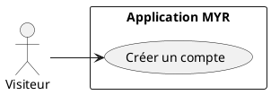
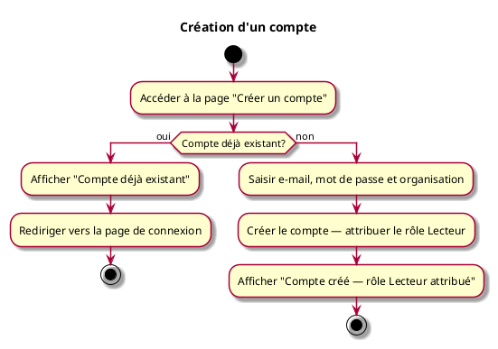

---
categorie: Compte et Accès
titre: "Création d'un compte"
probabilite: 5
impact: 5
importance: 25
etat: relire
---

# Création d'un compte

## Diagramme d'acteurs

## Contexte

L'utilisateur crée un compte sur le réseau désiré rattaché à une organisation. Le compte est validé automatiquement — aucune approbation manuelle n'est requise. Le rôle **Lecteur** est attribué par défaut, ce qui donne un accès en lecture seule au réseau.

Pour obtenir un rôle supplémentaire (Concepteur, Consommateur…), l'utilisateur soumet une demande depuis son profil après connexion (voir UCA08).

## Pré-conditions

- Réseau existant et accessible

## Scénario

**Étape initiale :** L'utilisateur va sur le site du réseau et clique sur "Créer un compte"

### Flux nominal

1. Il saisit son adresse e-mail et choisit un mot de passe
2. Il sélectionne l'organisation souhaitée
3. Le compte est créé et validé automatiquement
4. Un message de confirmation est affiché : "Compte créé — rôle Lecteur attribué"
5. L'utilisateur peut se connecter immédiatement

### Flux erreur — Compte déjà existant

1. Message d'erreur : "Compte déjà existant"
2. Redirection vers la page de connexion

## Post-conditions

- Compte actif avec le rôle **Lecteur** (lecture seule)

> **Note architecture :** La création du compte ne provisionne **pas** l'identité blockchain. L'identité Fabric CA (certificat X.509) est créée automatiquement lors de la **première connexion** (voir UCA02). Cette séparation permet d'automatiser le provisionnement Fabric sans action manuelle.

## Diagramme d'activités

