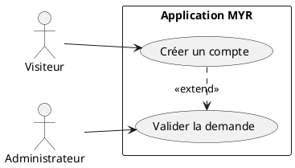
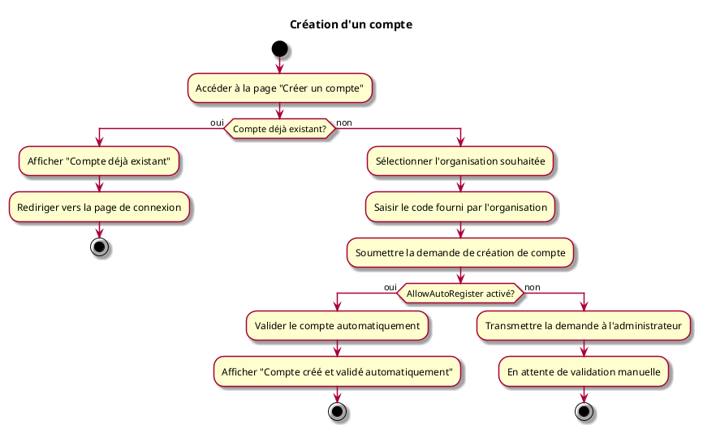

---
categorie: Compte et Accès
titre: "Création d'un compte"
probabilite: 5
impact: 5
importance: 25
etat: relire
---

# Création d'un compte

## Diagramme d'acteurs

## Contexte

L'utilisateur doit pouvoir se créer un compte sur le réseau désiré rattaché à une organisation. Réseau Myr par défaut (OrgForge).

## Pré-conditions

- Réseau existant et accessible
- Être en possession d'un code fourni par l'organisation

## Scénario

**Étape initiale :** L'utilisateur va sur le site du réseau et clique sur "Créer un compte"

### Flux nominal — Compte inexistant

1. Il définit à quelle organisation il souhaite appartenir
2. Il entre le code fourni par l'organisation par mesure de sécurité
3. Une demande est créée auprès de l'administrateur

### Flux alternatif — Réseau en mode ouvert (AllowAutoRegister)

1. Le réseau cible a le paramètre `AllowAutoRegister` activé
2. La demande de compte est validée automatiquement sans intervention de l'administrateur
3. Un message de confirmation est affiché : "Compte créé et validé automatiquement"
4. L'utilisateur peut se connecter immédiatement

### Flux erreur — Compte déjà existant

1. Message d'erreur : "Compte déjà existant"
2. Redirection vers la page de connexion

## Post-conditions

- Demande de création de compte soumise
- En attente de validation de l'administrateur (instantané si mode automatique)

> **Note architecture :** La création du compte en base de données ne provisionne **pas** l'identité blockchain. L'identité Fabric CA (certificat X.509) est créée automatiquement par le backend lors de la **première connexion** (voir UCA02 — flux "Provisionnement de l'identité blockchain"). Cette séparation permet d'automatiser le provisionnement Fabric sans action manuelle d'un administrateur pour chaque utilisateur.

## Diagramme d'activités

