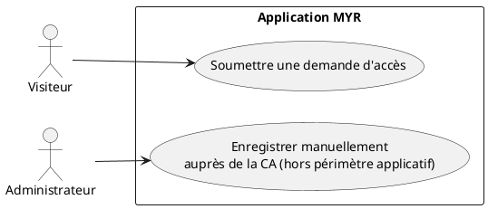
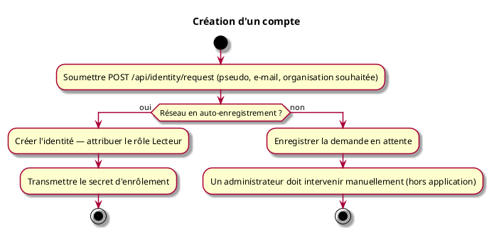

# Création d'un compte

## Diagramme d'acteurs

## Contexte

Il n'y a pas de compte email + mot de passe : l'identité est une paire de clés cryptographiques enregistrée auprès de l'autorité de certification (CA) du réseau blockchain. « Créer un compte » signifie obtenir un **secret d'enrôlement** valide pour un pseudo donné.

Deux chemins existent :

1. **Demande d'accès auto-traitée** : si le réseau autorise l'auto-enregistrement, la demande de l'utilisateur est immédiatement transformée en identité active — le secret d'enrôlement lui est retourné directement, avec le rôle **Lecteur** attribué par défaut.
2. **Demande d'accès en attente** : sinon, la demande est simplement enregistrée. Un administrateur doit alors créer l'identité manuellement (hors de cette application) et transmettre le secret à l'utilisateur par un autre canal.

Pour obtenir un rôle supplémentaire (Concepteur, Consommateur…), une action de l'administrateur reste nécessaire — voir UCA08.

**Sur la portée réelle de l'auto-enregistrement :** ce mécanisme supprime la validation humaine *au moment de la demande* — aucun administrateur n'approuve chaque visiteur individuellement. Il ne supprime pas pour autant toute autorité d'enregistrement : la CA du réseau exige qu'une identité **registrar**, dotée des privilèges d'enregistrement, signe chaque nouvelle identité créée. Cette identité registrar est provisionnée une seule fois, à la création du réseau, puis utilisée de façon automatisée par l'application pour chaque demande — ce n'est donc pas une création de compte totalement décentralisée (comme une génération de clé locale sans aucune autorité), mais une automatisation du rôle d'autorité d'enregistrement (voir `specs/3-Conception/Conception_intro.md` ADR-07 pour la décision d'architecture).

#incoherence chaque création de compte doit etre accessible indépendamment du noeud. Car l'interet est d'éviter la perte de donnée ou des accès si un serveur est HS. 

#remarque Si l'administrateur l'y autorise, une lecture sans compte doit pouvoir etre possible (comme un accès aux produits d'un site)

## Pré-conditions

- Réseau existant et accessible

## Scénario

**Étape initiale :** Un client (interface graphique tierce, script, plugin...) soumet une demande d'accès via `POST /api/identity/request` — ou, pour le compte d'un utilisateur, un administrateur exécute la commande CLI équivalente (`myr identity request --pseudo 
 --email <e> --org-id <id>`)

### Flux nominal — Auto-enregistrement

1. Le pseudo, l'e-mail et l'organisation souhaitée sont transmis (`POST /api/identity/request` — pseudo, email, org_id)
2. Le réseau autorise l'auto-enregistrement : l'identité est créée immédiatement avec le rôle Lecteur
3. Un secret d'enrôlement est retourné dans la réponse
4. Ce secret permet de se connecter immédiatement (voir UCA02)

### Flux alternatif — Demande en attente

1. Étapes identiques, mais le réseau n'autorise pas l'auto-enregistrement
2. La demande est enregistrée avec le statut « en attente » (réponse sans secret)
3. **Un administrateur doit intervenir manuellement** pour créer l'identité et transmettre le secret — aucune notification ni file d'attente de traitement n'est proposée par l'API elle-même

## Post-conditions

- Une demande d'accès existe (traitée ou en attente)
- Si traitée : une identité active existe avec le rôle Lecteur, et l'utilisateur dispose d'un secret d'enrôlement

> **Note architecture :** Il n'existe pas d'étape séparée de « provisionnement de l'identité blockchain » — l'identité *est* le compte, et se connecter (UCA02) *est* l'action qui l'enrôle auprès de la CA.

## Diagramme d'activités

