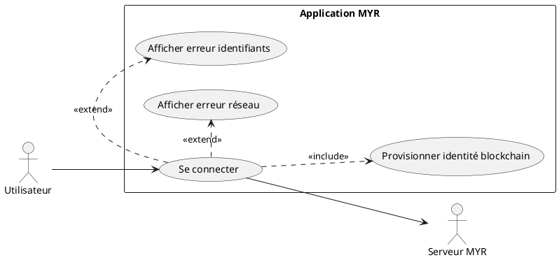
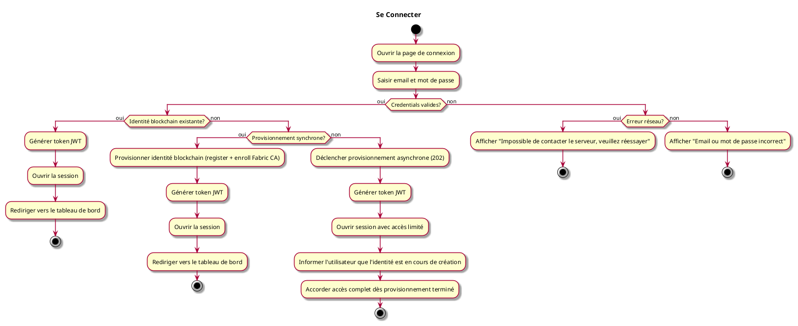

---
categorie: Compte et Accès
titre: "Se Connecter"
probabilite: 5
impact: 5
importance: 25
etat: relire
---

# Se Connecter

## Diagramme d'acteurs

## Contexte

L'utilisateur se connecte via un formulaire email / mot de passe. Le serveur valide les identifiants en base de données et retourne un token de session (JWT).

À chaque connexion, le serveur vérifie si l'utilisateur possède déjà une identité sur le réseau blockchain configuré. Si ce n'est pas le cas (première connexion ou réseau nouvellement rattaché), le serveur provisionne automatiquement cette identité à partir du compte en base de données — sans action supplémentaire de l'utilisateur. Le provisionnement est abstrait du type de blockchain utilisé (architecture hexagonale).

**Mécanisme de provisionnement Fabric CA :** Le backend Myr détient une identité "registrar" (provisionnée une seule fois lors de la création du réseau par un administrateur). Pour chaque nouvel utilisateur, le backend appelle l'API REST de Fabric CA (`register` puis `enroll`) afin d'émettre un certificat X.509. Aucune intervention manuelle d'un administrateur n'est requise pour chaque utilisateur. Les rôles par défaut (attributs chaincode) sont assignés lors de l'enrôlement selon la configuration du réseau. Cette architecture est compatible avec le principe de décentralisation d'HyperLedger Fabric : la DB comptes gère la couche session/auth web (JWT), tandis que Fabric CA gère la couche identité blockchain.

## Pré-conditions

- Avoir un compte créé (voir UCA01)
- Réseau MYR disponible et accessible

## Scénario

**Étape initiale :** L'utilisateur ouvre la page de connexion du réseau MYR souhaité

### Flux nominal — Connexion standard

1. L'utilisateur saisit son email et son mot de passe
2. Le serveur valide les identifiants en base de données
3. Le serveur vérifie que l'identité blockchain de l'utilisateur est active
4. Un token JWT est retourné et la session est ouverte
5. L'utilisateur est redirigé vers le tableau de bord

### Flux nominal — Première connexion (provisionnement de l'identité blockchain)

1. L'utilisateur saisit son email et son mot de passe
2. Le serveur valide les identifiants en base de données
3. Aucune identité blockchain n'existe pour cet utilisateur : le serveur déclenche le provisionnement
4. Le provisionnement est synchrone : l'identité est créée immédiatement
5. Un token JWT est retourné et la session est ouverte

### Flux nominal — Provisionnement en attente (asynchrone)

1. Les étapes 1 à 3 sont identiques au flux précédent
2. Le provisionnement de l'identité blockchain est asynchrone (réponse 202)
3. La session est ouverte avec accès limité — l'utilisateur est informé que son identité est en cours de création
4. Une fois le provisionnement terminé, l'accès complet est accordé sans reconnexion

### Flux erreur — Identifiants invalides

1. Le serveur retourne une erreur d'authentification
2. Message d'erreur : "Email ou mot de passe incorrect"
3. Le formulaire reste accessible pour une nouvelle tentative

### Flux erreur — Serveur inaccessible

1. La requête échoue (timeout ou erreur réseau)
2. Message d'erreur : "Impossible de contacter le serveur, veuillez réessayer"

## Post-conditions

- L'utilisateur est connecté, session JWT active
- L'identité blockchain de l'utilisateur est active sur le réseau
- L'accès aux fonctionnalités est accordé selon le rôle attribué

## Diagramme d'activités

