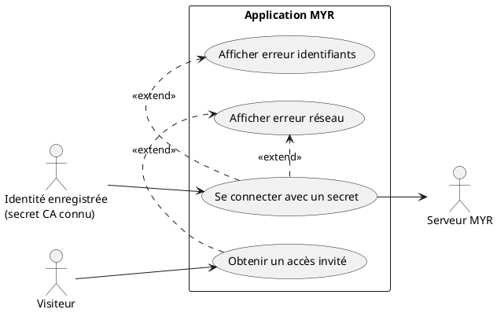
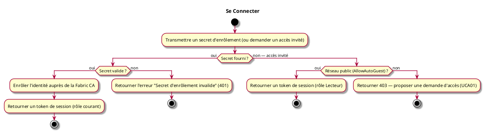

# Se Connecter

## Diagramme d'acteurs

## Contexte

Il n'y a pas de formulaire email / mot de passe. « Se connecter » consiste à fournir le **secret d'enrôlement** délivré par un administrateur (voir UCA01) : le serveur enrôle (ou ré-enrôle) l'identité auprès de la Fabric CA du réseau, puis ouvre une session identifiée par un **token opaque** (pas un JWT).

Il n'y a pas d'étape de « provisionnement de l'identité blockchain » distincte de la connexion : enrôler l'identité auprès de la CA *est* l'action de connexion elle-même. Il n'existe donc pas de flux séparé « première connexion » vs « connexion standard » — le même appel (`POST /api/identity/session`) couvre les deux cas.

Un second mode existe pour un réseau public : l'**accès invité**, qui ne requiert aucun secret ni identité préalable (si le réseau l'autorise) et attribue directement un rôle Lecteur.

## Pré-conditions

- Pour une connexion avec secret : une identité a été enregistrée auprès de la CA (UCA01), et son secret d'enrôlement est connu
- Pour un accès invité : le réseau MYR visé existe et est accessible

## Scénario

**Étape initiale :** Un client transmet le secret reçu de l'administrateur via `POST /api/identity/session` (ou demande un accès invité via `POST /api/identity/guest`)

### Flux nominal — Connexion avec secret

1. Le pseudo, le secret d'enrôlement et l'organisation sont transmis (`POST /api/identity/session`)
2. Le serveur (ré-)enrôle l'identité auprès de la Fabric CA du réseau
3. Un token de session est retourné dans la réponse, associé au rôle courant de l'identité
4. Le client inclut ce token dans l'en-tête `X-Myr-Token` pour les requêtes suivantes

### Flux nominal — Accès invité (réseau public)

1. Un accès invité est demandé (`POST /api/identity/guest`), sans secret ni identité
2. Le réseau autorise l'accès automatique
3. Un token de session avec rôle Lecteur est délivré immédiatement — aucun enrôlement CA n'a lieu

### Flux alternatif — Accès invité refusé (réseau privé)

1. Le réseau n'autorise pas l'accès automatique (`403 Forbidden`)
2. Une demande d'accès peut être soumise (voir UCA01), mais la connexion directe est refusée

### Flux erreur — Secret invalide

1. Le serveur retourne une erreur d'enrôlement (`401 Unauthorized`)
2. Message d'erreur : « Secret d'enrôlement invalide »
3. Une nouvelle tentative peut être soumise avec un secret corrigé

### Flux erreur — Serveur inaccessible

1. La requête échoue (timeout ou erreur réseau)
2. Le client reçoit une erreur de connexion et doit réessayer

## Post-conditions

- L'utilisateur dispose d'un token de session valide (7 jours) associé à un rôle
- L'accès aux fonctionnalités est accordé selon ce rôle

## Diagramme d'activités

