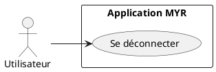
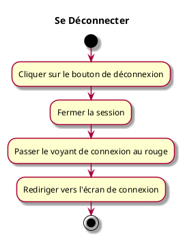

---
categorie: Compte et Accès
titre: "Se Déconnecter"
probabilite: 5
impact: 5
importance: 25
etat: relire
---

# Se Déconnecter

## Diagramme d'acteurs

## Contexte

L'utilisateur arrive à se déconnecter du réseau depuis l'interface.

## Pré-conditions

- Être connecté au réseau

## Scénario

**Étape initiale :** L'utilisateur clique sur le bouton de déconnexion

### Flux nominal — Déconnexion réussie

1. La session est fermée
2. Le voyant de connexion passe au rouge
3. L'utilisateur est redirigé vers l'écran de connexion

## Post-conditions

- La session est terminée
- Le voyant de connexion est rouge

## Diagramme d'activités

