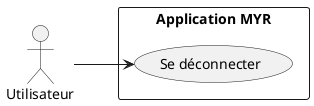
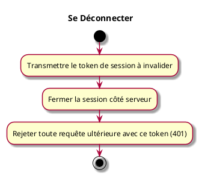

---
categorie: Compte et Accès
titre: "Se Déconnecter"
probabilite: 5
impact: 5
importance: 25
etat: relire
---

# Se Déconnecter

## Diagramme d'acteurs

## Contexte

Un client (interface graphique tierce, script, plugin...) met fin à une session active en invalidant son token.

## Pré-conditions

- Disposer d'un token de session valide

## Scénario

**Étape initiale :** Le client transmet son token de session (`X-Myr-Token`) pour clôturer la session

### Flux nominal — Déconnexion réussie

1. La session associée au token est invalidée côté serveur
2. Toute requête ultérieure avec ce token est rejetée (`401 Unauthorized`)

## Post-conditions

- La session est terminée et le token n'est plus valide

## Diagramme d'activités

