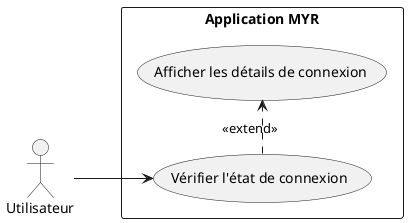
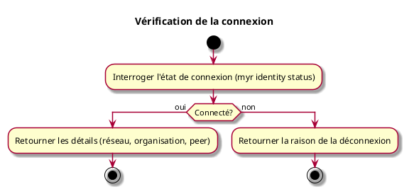

---
categorie: Compte et Accès
titre: "Vérification de la connexion"
probabilite: 2
impact: 3
importance: 6
etat: relire
---

# Vérification de la connexion

## Diagramme d'acteurs

## Contexte

L'état de connexion (connecté / déconnecté, réseau, organisation, peer) est consultable à tout moment via l'API ou le CLI.

## Pré-conditions

- Disposer d'un token de session (le cas échéant)

## Scénario

**Étape initiale :** L'état de connexion est interrogé (`myr identity status` ou l'appel API équivalent)

### Flux nominal — Connecté

1. La session est active
2. Le statut retourné inclut les détails de connexion (réseau, organisation, peer)

### Flux nominal — Déconnecté

1. La session est absente ou invalide
2. Le statut retourné indique la raison de la déconnexion

## Post-conditions

- L'état de connexion est consultable à tout moment via l'API ou le CLI

## Diagramme d'activités

