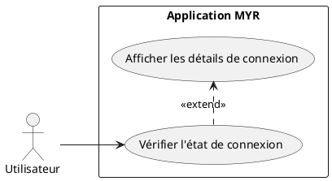
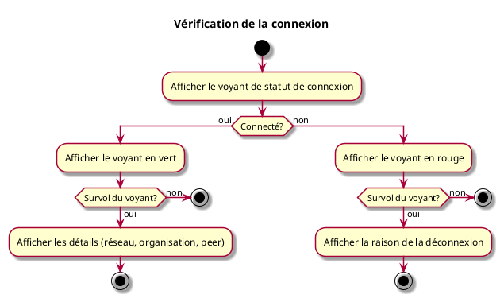

---
categorie: Compte et Accès
titre: "Vérification de la connexion"
probabilite: 2
impact: 3
importance: 6
etat: relire
---

# Vérification de la connexion

## Diagramme d'acteurs

## Contexte

Visualisation de l'état de connexion par un voyant Vert sur l'interface avec détail de la connexion en le survolant. Le voyant est rouge si déconnecté.

## Pré-conditions

- Application ouverte

## Scénario

**Étape initiale :** L'application affiche en permanence un voyant de statut de connexion

### Flux nominal — Connecté

1. Le voyant est affiché en vert
2. En survolant le voyant, les détails de connexion s'affichent (réseau, organisation, peer)

### Flux nominal — Déconnecté

1. Le voyant est affiché en rouge
2. En survolant, un message indique la raison de la déconnexion

## Post-conditions

- L'utilisateur connaît à tout moment l'état de sa connexion

## Diagramme d'activités

