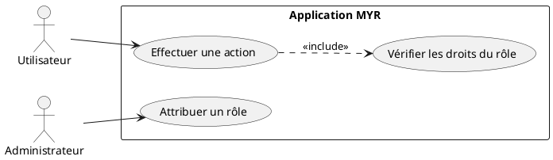
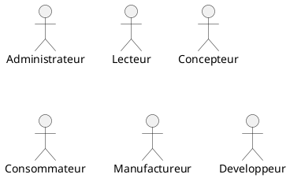
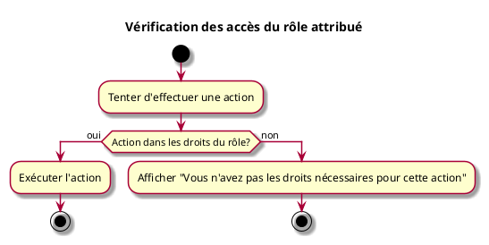

---
categorie: Compte et Accès
titre: "Vérification des accès du rôle attribué"
probabilite: 1
impact: 3
importance: 3
etat: relire
---

# Vérification des accès du rôle attribué

## Diagramme d'acteurs

## Contexte

Vérifier que l'utilisateur peut réaliser les actions autorisées par son rôle et ne peut pas réaliser celles qui lui sont refusées.

## Pré-conditions

- Être connecté au réseau
- Rôle attribué à l'utilisateur

## Scénario

**Étape initiale :** L'utilisateur tente d'effectuer une action

### Flux nominal — Action autorisée

1. L'action est dans les droits du rôle attribué
2. Le système exécute l'action

### Flux erreur — Action non autorisée

1. L'action n'est pas dans les droits du rôle attribué
2. Message d'erreur : "Vous n'avez pas les droits nécessaires pour cette action"

## Post-conditions

- Les droits du rôle sont respectés

## Diagrammes

### Rôles disponibles dans le système

### Diagramme d'activités

