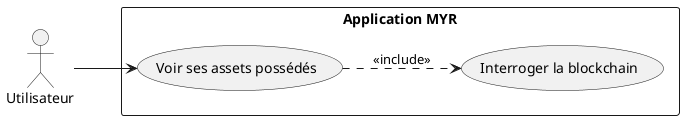
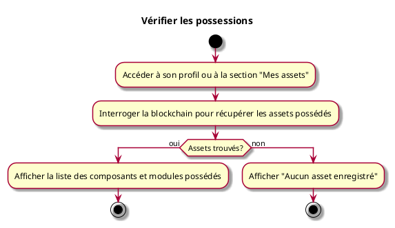

---
categorie: Compte et Accès
titre: "Vérifier les possessions"
probabilite: 3
impact: 3
etat: relire
---

# Vérifier les possessions

## Diagramme d'acteurs

## Contexte

L'utilisateur peut consulter la liste de ses assets (composants, modules) enregistrés sur le réseau dont il est propriétaire.

## Pré-conditions

- Être connecté au réseau

## Scénario

**Étape initiale :** L'utilisateur accède à son profil ou à la section "Mes assets"

### Flux nominal — Affichage des possessions

1. Le système interroge la blockchain pour récupérer les assets dont l'utilisateur est propriétaire
2. La liste des composants et modules possédés est affichée

### Flux nominal — Aucune possession

1. Un message indique qu'aucun asset n'est enregistré

## Post-conditions

- L'utilisateur a une vue complète de ses possessions sur le réseau

## Diagramme d'activités

