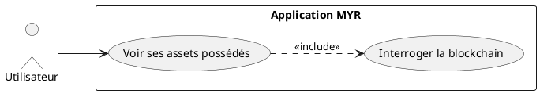
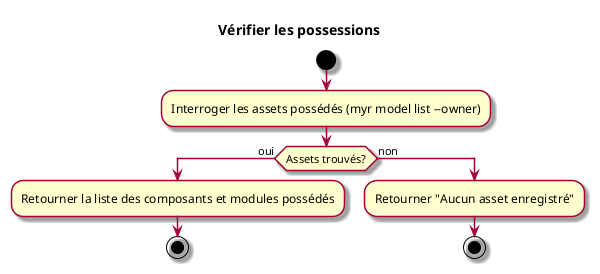

---
categorie: Compte et Accès
titre: "Vérifier les possessions"
probabilite: 3
impact: 3
etat: relire
---

# Vérifier les possessions

## Diagramme d'acteurs

## Contexte

L'utilisateur peut consulter la liste de ses assets (composants, modules) enregistrés sur le réseau dont il est propriétaire.

## Pré-conditions

- Être connecté au réseau

## Scénario

**Étape initiale :** Les assets possédés par l'identité connectée sont interrogés (`myr model list --owner <identityID>` ou l'appel API équivalent)

### Flux nominal — Affichage des possessions

1. Le système interroge la blockchain pour récupérer les assets dont l'identité est propriétaire
2. La liste des composants et modules possédés est retournée

### Flux nominal — Aucune possession

1. La réponse indique qu'aucun asset n'est enregistré

## Post-conditions

- L'utilisateur a une vue complète de ses possessions sur le réseau

## Diagramme d'activités

