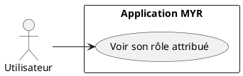
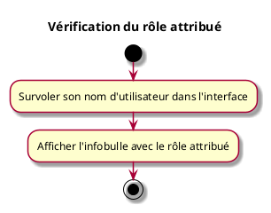

---
categorie: Compte et Accès
titre: "Vérification du rôle attribué"
probabilite: 1
impact: 1
importance: 1
etat: relire
---

# Vérification du rôle attribué

## Diagramme d'acteurs

## Contexte

Visualisation du rôle attribué en survolant le nom utilisateur affiché dans l'interface.

## Pré-conditions

- Être connecté au réseau

## Scénario

**Étape initiale :** L'utilisateur survole son nom d'utilisateur affiché dans l'interface

### Flux nominal — Affichage du rôle

1. Une infobulle affiche le rôle attribué (ex : Concepteur, Consommateur, Manufactureur...)

## Post-conditions

- L'utilisateur connaît son rôle actuel

## Diagramme d'activités

