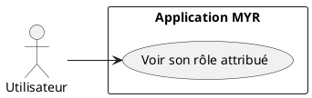
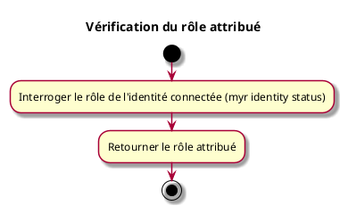

---
categorie: Compte et Accès
titre: "Vérification du rôle attribué"
probabilite: 1
impact: 1
importance: 1
etat: relire
---

# Vérification du rôle attribué

## Diagramme d'acteurs

## Contexte

Le rôle attribué à l'identité connectée est consultable via l'API ou le CLI.

## Pré-conditions

- Être connecté au réseau

## Scénario

**Étape initiale :** Le rôle de l'identité connectée est interrogé (`myr identity status` ou l'appel API équivalent)

### Flux nominal — Affichage du rôle

1. Le rôle attribué est retourné (ex : Concepteur, Consommateur, Manufactureur...)

## Post-conditions

- L'utilisateur connaît son rôle actuel

## Diagramme d'activités

