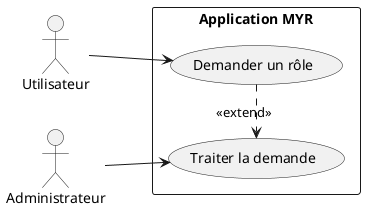
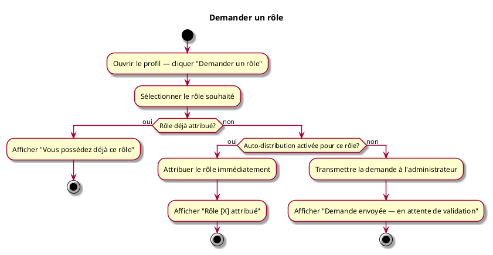

# Demander un rôle

## Diagramme d'acteurs

## Contexte

Un utilisateur connecté (rôle Lecteur ou autre) peut demander un rôle supplémentaire depuis son profil. La demande est traitée automatiquement si le rôle est configuré en auto-distribution sur ce réseau, ou soumise à l'administrateur dans le cas contraire.

## Pré-conditions

- Être connecté
- Rôle cible différent du rôle déjà détenu

## Scénario

**Étape initiale :** L'utilisateur ouvre son profil et clique sur "Demander un rôle"

### Flux nominal — Attribution automatique

1. L'utilisateur sélectionne le rôle souhaité
2. Le rôle cible est configuré en auto-distribution sur ce réseau
3. Le rôle est attribué immédiatement
4. Message de confirmation : "Rôle [X] attribué"

### Flux alternatif — Validation manuelle par l'administrateur

1. L'utilisateur sélectionne le rôle souhaité
2. Le rôle cible nécessite une validation admin
3. La demande est transmise à l'administrateur
4. Message : "Demande envoyée — en attente de validation"
5. L'utilisateur conserve son rôle courant jusqu'à la décision

### Flux erreur — Rôle déjà attribué

1. Le rôle sélectionné est déjà détenu par l'utilisateur
2. Message : "Vous possédez déjà ce rôle"

## Post-conditions

- Rôle attribué immédiatement (auto-distribution), ou demande en attente de validation (manuel)

## Diagramme d'activités

