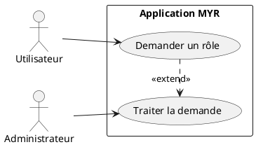
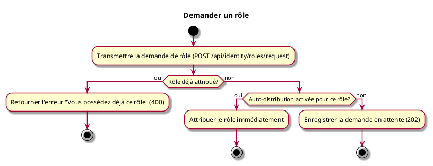

# Demander un rôle

## Diagramme d'acteurs

## Contexte

Un utilisateur connecté (rôle Lecteur ou autre) peut demander un rôle supplémentaire depuis son profil. La demande est traitée automatiquement si le rôle est configuré en auto-distribution sur ce réseau, ou soumise à l'administrateur dans le cas contraire.

## Pré-conditions

- Être connecté
- Rôle cible différent du rôle déjà détenu

## Scénario

**Étape initiale :** Le client transmet une demande de rôle pour l'identité connectée (`POST /api/identity/roles/request` — rôle souhaité)

### Flux nominal — Attribution automatique

1. Le rôle souhaité est transmis
2. Le rôle cible est configuré en auto-distribution sur ce réseau
3. Le rôle est attribué immédiatement — la réponse indique le nouveau rôle actif

### Flux alternatif — Validation manuelle par l'administrateur

1. Le rôle souhaité est transmis
2. Le rôle cible nécessite une validation admin
3. La demande est enregistrée en attente (`202 Accepted`)
4. Le rôle courant est conservé jusqu'à la décision de l'administrateur (`myr identity set-role`)

### Flux erreur — Rôle déjà attribué

1. Le rôle demandé est déjà détenu par l'identité
2. Réponse d'erreur : « Vous possédez déjà ce rôle » (`400 Bad Request`)

## Post-conditions

- Rôle attribué immédiatement (auto-distribution), ou demande en attente de validation (manuel)

## Diagramme d'activités

