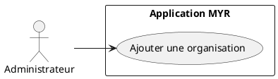
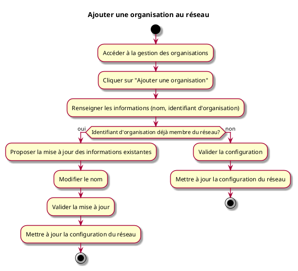

# Ajouter une organisation au réseau

## Diagramme d'acteurs

## Contexte

L'administrateur peut ajouter une organisation (fabricant, vendeur, association…) au réseau. Une organisation est identifiée par un **identifiant d'organisation** unique au sein du réseau. Les rôles et droits d'accès sont attribués séparément, dans un second temps (voir UCADM06 et UCADM07).

## Pré-conditions

- Être connecté en tant qu'administrateur du réseau
- Réseau opérationnel

## Scénario

**Étape initiale :** L'administrateur accède à la gestion des organisations

### Flux nominal — Organisation ajoutée

1. Il clique sur "Ajouter une organisation"
2. Il renseigne les informations : nom, identifiant d'organisation
3. Il valide : la configuration du réseau est mise à jour
4. L'organisation peut désormais gérer ses propres utilisateurs

### Flux alternatif — Organisation déjà membre du réseau

1. L'administrateur saisit un identifiant d'organisation déjà enregistré sur le réseau
2. Le système détecte que l'organisation existe et propose de mettre à jour ses informations (nom)
3. L'administrateur modifie les informations souhaitées et valide
4. La configuration du réseau est mise à jour sans recréation de l'organisation

## Post-conditions

- L'organisation est disponible sur le réseau
- Des rôles peuvent lui être attribués via UCADM06
- L'administrateur de l'organisation peut créer des comptes pour ses membres

## Diagramme d'activités

