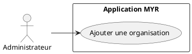
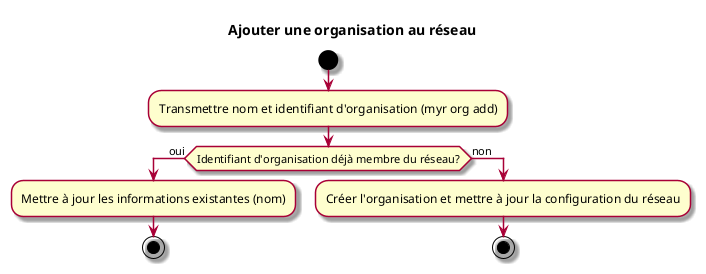

# Ajouter une organisation au réseau

## Diagramme d'acteurs

## Contexte

L'administrateur peut ajouter une organisation (fabricant, vendeur, association…) au réseau. Une organisation est identifiée par un **identifiant d'organisation** unique au sein du réseau. Les rôles et droits d'accès sont attribués séparément, dans un second temps (voir UCADM06 et UCADM07).

## Pré-conditions

- Être connecté en tant qu'administrateur du réseau
- Réseau opérationnel

## Scénario

**Étape initiale :** Sur le serveur (SSH), l'administrateur exécute `myr org add --id <orgID> --name <nom>` (équivalent `POST /api/networks/orgs`)

### Flux nominal — Organisation ajoutée

1. L'identifiant et le nom de l'organisation sont transmis
2. La configuration du réseau est mise à jour
3. L'organisation peut désormais gérer ses propres utilisateurs

### Flux alternatif — Organisation déjà membre du réseau

1. L'identifiant d'organisation transmis est déjà enregistré sur le réseau
2. Le système détecte que l'organisation existe et met à jour ses informations (nom) plutôt que de la recréer
3. La configuration du réseau est mise à jour sans recréation de l'organisation

## Post-conditions

- L'organisation est disponible sur le réseau
- Des rôles peuvent lui être attribués via UCADM06
- L'administrateur de l'organisation peut créer des comptes pour ses membres

## Diagramme d'activités

