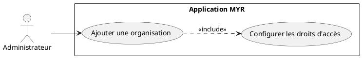
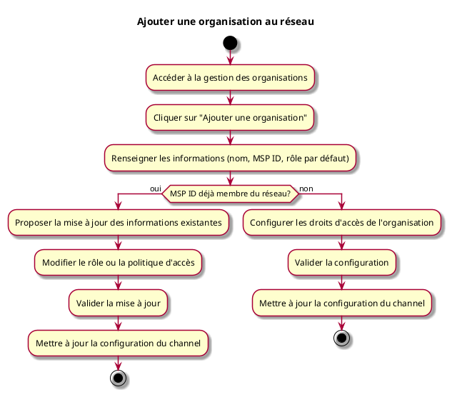

---
categorie: Administration
titre: "Ajouter une organisation au réseau"
---

# Ajouter une organisation au réseau

## Diagramme d'acteurs

## Contexte

L'administrateur peut ajouter une organisation (Fabricant, vendeur, association...) au réseau avec son rôle et ses droits d'accès.

## Pré-conditions

- Être connecté en tant qu'administrateur du réseau
- Réseau opérationnel

## Scénario

**Étape initiale :** L'administrateur accède à la gestion des organisations

### Flux nominal — Organisation ajoutée

1. Il clique sur "Ajouter une organisation"
2. Il renseigne les informations : nom, MSP ID, rôle par défaut
3. Il configure les droits d'accès de l'organisation
4. Il valide : la configuration du channel est mise à jour
5. L'organisation peut désormais gérer ses propres utilisateurs

### Flux alternatif — Organisation déjà membre du réseau

1. L'administrateur saisit un MSP ID déjà enregistré sur le réseau
2. Le système détecte que l'organisation existe et propose de mettre à jour ses informations (rôle par défaut, politique d'accès)
3. L'administrateur modifie les informations souhaitées et valide
4. La configuration du channel est mise à jour sans recréation de l'organisation

## Post-conditions

- L'organisation est disponible sur le réseau avec les droits définis
- L'administrateur de l'organisation peut créer des comptes pour ses membres

## Diagramme d'activités

