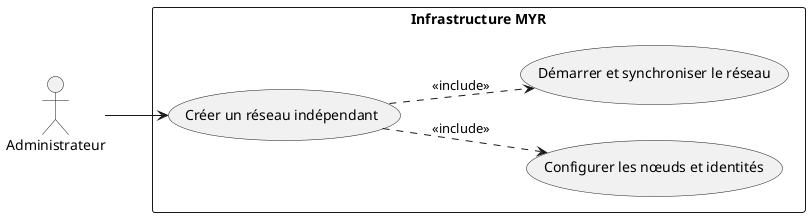
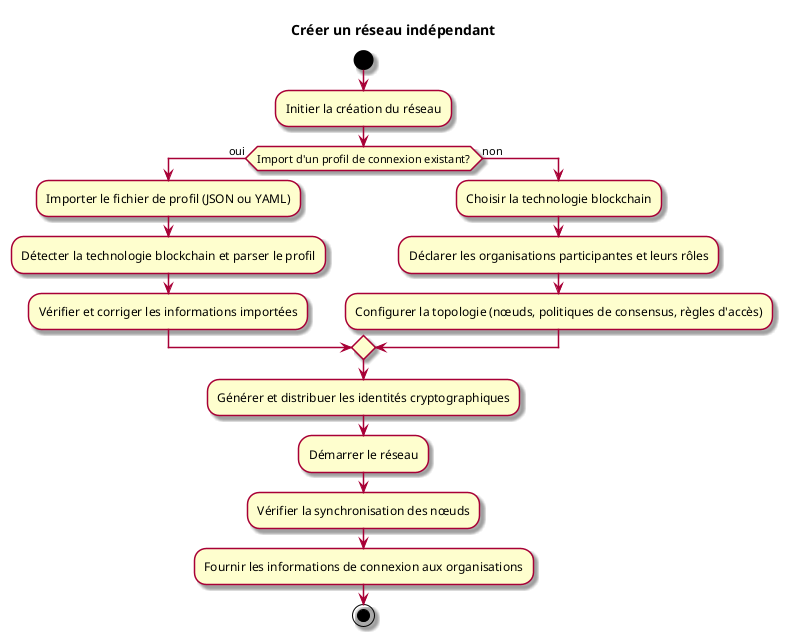

# Créer un réseau indépendant

## Diagramme d'acteurs

## Contexte

Un administrateur d'un organisme peut créer un nouveau réseau MYR indépendant. Il choisit la technologie blockchain sous-jacente selon les besoins de son déploiement (performance, confidentialité, disponibilité des nœuds, contraintes légales ou obsolescence d'une technologie). Le réseau nécessite un nombre minimum de nœuds pour garantir sa résilience et sa disponibilité.

## Pré-conditions

- Avoir les droits d'administration de l'infrastructure
- Disposer d'au moins 3 serveurs accessibles avec une adresse réseau stable
- L'environnement serveur est prêt à accueillir des nœuds pour la technologie blockchain choisie

## Scénario

**Étape initiale :** L'administrateur initie la création du réseau

### Flux nominal — Réseau créé

1. Il choisit la technologie blockchain à utiliser pour ce réseau
2. Il déclare les organisations participantes et leurs rôles dans le réseau
3. Il configure la topologie du réseau (nœuds, politiques de consensus, règles d'accès)
4. Il génère et distribue les identités cryptographiques des participants
5. Il démarre le réseau et vérifie que les nœuds sont synchronisés
6. Il fournit aux organisations les informations de connexion leur permettant de rejoindre le réseau

### Flux alternatif — Import d'un profil de connexion existant

1. Au lieu de configurer le réseau manuellement, l'administrateur importe un fichier de profil de connexion (JSON ou YAML)
2. Le système détecte le format et la technologie blockchain depuis le profil, et pré-remplit automatiquement les champs (organisations, nœuds, politiques)
3. L'administrateur vérifie les informations importées et corrige si nécessaire
4. Le réseau est créé à partir du profil importé

## Post-conditions

- Le réseau indépendant est opérationnel avec le nombre minimum de nœuds synchronisés
- Les organisations déclarées peuvent s'y connecter

## Diagramme d'activités

