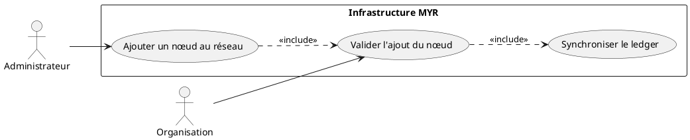
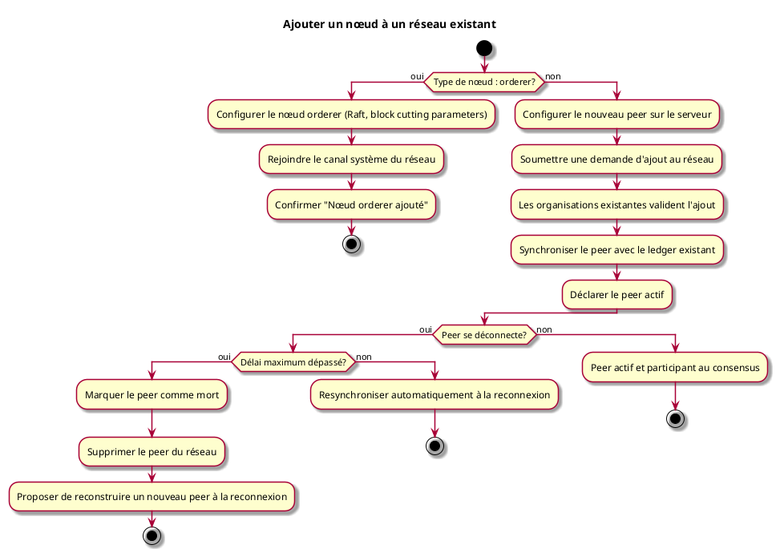

---
categorie: Administration
titre: "Ajouter un nœud à un réseau existant"
---

# Ajouter un nœud à un réseau existant

## Diagramme d'acteurs

## Contexte

Un nœud (peer) supplémentaire peut être ajouté à un réseau existant pour étendre sa capacité et sa résilience. Le peer doit être validé selon les règles établies par le réseau.

## Pré-conditions

- Être administrateur du réseau
- Réseau existant et opérationnel
- Serveur disponible avec IP fixe publique (port 7051 ouvert)

## Scénario

**Étape initiale :** L'administrateur configure le nouveau peer sur son serveur

### Flux nominal — Peer ajouté avec succès

1. L'administrateur soumet une demande d'ajout au réseau
2. Les organisations existantes valident l'ajout selon la politique du réseau
3. Le peer est synchronisé avec le ledger existant
4. Le peer est déclaré actif et participe au consensus

### Flux alternatif — Nœud de type orderer

1. L'administrateur choisit d'ajouter un nœud orderer (et non un peer)
2. Il configure les paramètres spécifiques aux orderers (consensus Raft, block cutting parameters)
3. Le nœud orderer rejoint le canal système du réseau
4. Confirmation : "Nœud orderer ajouté au réseau"

### Flux erreur — Peer déconnecté temporairement

1. Le peer se désynchronise pendant la déconnexion
2. À la reconnexion (avant délai maximum), le peer se resynchronise automatiquement

### Flux erreur — Peer déconnecté trop longtemps

1. Le délai maximum de déconnexion est dépassé
2. Le peer est marqué comme mort et supprimé du réseau
3. À la reconnexion, un message propose de reconstruire un nouveau peer

## Post-conditions

- Le nouveau nœud est actif et synchronisé avec le réseau
- Il contribue à la résilience et au consensus du réseau

## Diagramme d'activités

