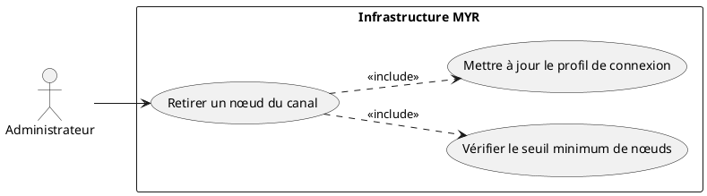
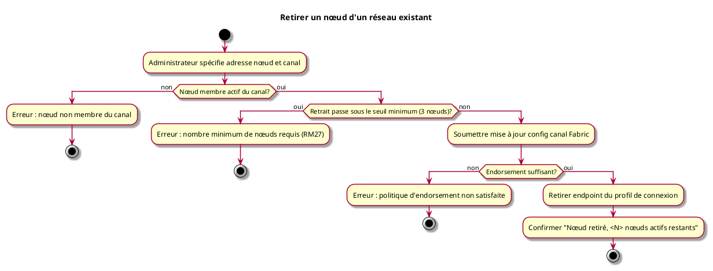

# Retirer un nœud d'un réseau existant

## Diagramme d'acteurs

## Contexte

Un administrateur peut retirer administrativement un nœud (peer) d'un réseau existant — par exemple pour remplacer un serveur, réorganiser la topologie ou éliminer un nœud définitivement hors service.

Cette opération est distincte du retrait automatique d'un peer mort (flux erreur d'UCADM03) : elle est initiée volontairement par l'administrateur et soumet une mise à jour de configuration du canal Fabric (channel config update). Le retrait est enregistré comme un nouveau bloc dans le ledger — il ne supprime aucune donnée historique (RM06).

## Pré-conditions

- Être administrateur du réseau avec wallet Fabric valide
- Réseau existant et opérationnel
- Au moins 4 nœuds actifs sur le canal (pour rester au-dessus du seuil de 3 après retrait — RM27)
- Le nœud à retirer est membre actif du canal

## Scénario

**Étape initiale :** L'administrateur identifie le nœud à retirer et exécute la commande CLI.

### Flux nominal — Peer retiré avec succès

1. L'administrateur fournit l'adresse du nœud à retirer et le canal cible
2. Le système vérifie que le nœud est membre actif du canal
3. Le système vérifie que le retrait ne passe pas sous le seuil minimum de 3 nœuds actifs (RM27)
4. La mise à jour de configuration du canal Fabric est soumise
5. Les organisations existantes valident la mise à jour selon la politique d'endorsement
6. Le nœud est retiré des endpoints actifs du profil de connexion
7. Confirmation : `Nœud <adresse> retiré du réseau. <N> nœuds actifs restants.`

### Flux erreur — Nombre de nœuds insuffisant après retrait

1. Le système détecte que le retrait provoquerait un passage sous 3 nœuds actifs
2. Aucune transaction n'est soumise
3. Message : `Erreur : le réseau doit conserver au moins 3 nœuds actifs. Retrait impossible (actuellement <N> nœuds actifs).`

### Flux erreur — Nœud déjà absent du canal

1. L'adresse spécifiée n'est pas membre actif du canal
2. Aucune transaction n'est soumise
3. Message : `Erreur : <adresse> n'est pas membre actif du canal <canal>.`

### Flux erreur — Endorsement insuffisant

1. La politique d'endorsement du canal requiert des signatures que l'administrateur ne peut pas fournir seul
2. Le service retourne une erreur d'endorsement
3. Message : `Erreur : politique d'endorsement non satisfaite. Contacter les autres administrateurs d'organisation.`

## Post-conditions

- Le nœud est retiré de la configuration du canal Fabric (enregistré dans un nouveau bloc de configuration)
- Le profil de connexion (`connection-profiles/`) est mis à jour (endpoint supprimé)
- Le nœud retiré conserve son ledger local — ses données ne sont pas détruites

## Diagramme d'activités

