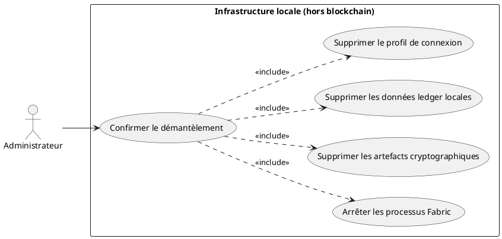
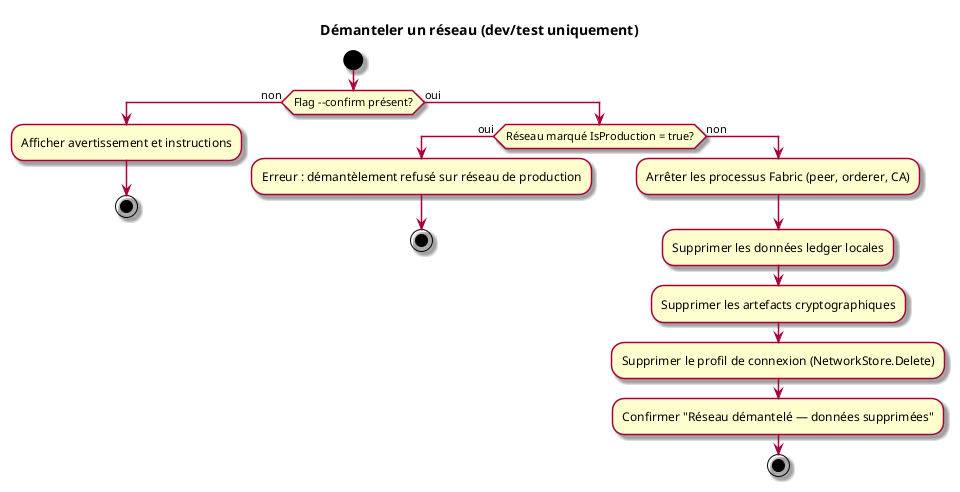

# Démanteler un réseau (dev/test uniquement)

## Diagramme d'acteurs



## Contexte

Lors du développement et des tests, un administrateur peut avoir besoin de démanteler entièrement un réseau Fabric pour en recréer un propre — par exemple après une série de tests de validation du processus de création réseau (UCADM02) ou pour repartir d'un état vierge.

Cette opération est **hors périmètre blockchain** : elle arrête des processus système et supprime des fichiers locaux. Elle ne soumet aucune transaction Fabric et ne constitue pas une violation de l'immuabilité du ledger (RM28). Les données blockchain que le réseau avait produites disparaissent simplement avec la destruction de l'infrastructure locale.

**Cette opération est irréversible. Elle n'est disponible que via le CLI admin — jamais via l'API REST.**

## Pré-conditions

- Être administrateur avec accès à l'infrastructure locale
- Le réseau cible n'est pas marqué comme réseau de production (`IsProduction: false`)
- Commande exécutée via le CLI admin (`myr`)
- Flag `--confirm` explicitement fourni

## Scénario

**Étape initiale :** L'administrateur exécute `myr network destroy <id> --confirm`.

### Flux nominal — Réseau démantelé avec succès

1. L'administrateur fournit l'ID du réseau et le flag `--confirm`
2. Le système vérifie que le réseau n'est pas marqué en production
3. Les processus Fabric sont arrêtés (peer, orderer, CA) sur la machine locale
4. Les données ledger locales sont supprimées (`/var/hyperledger/production/` ou équivalent)
5. Les artefacts cryptographiques sont supprimés (certificats, clés, channel artifacts, wallet)
6. Le profil de connexion est supprimé du stockage local (`NetworkStore.Delete()`)
7. Confirmation : `Réseau "<nom>" démantelé. Toutes les données locales ont été supprimées.`

### Flux erreur — Confirmation absente

1. L'administrateur exécute la commande sans le flag `--confirm`
2. Le système affiche un avertissement et refuse d'agir
3. Message :
   ```
   ATTENTION : Cette opération est irréversible.
   Elle supprimera toutes les données locales du réseau "<nom>".
   Utilisez --confirm pour confirmer : myr network destroy <id> --confirm
   ```

### Flux erreur — Réseau marqué en production

1. Le profil de connexion porte le flag `IsProduction: true`
2. Le système refuse l'opération, même avec `--confirm`
3. Message : `Erreur : "<nom>" est marqué comme réseau de production. Démantèlement refusé.`

### Flux erreur — Processus Fabric non arrêtables

1. Un ou plusieurs processus Fabric ne répondent pas à l'arrêt
2. Le système signale les processus concernés
3. Message : `Avertissement : processus <pid> (peer) non arrêté. Suppression des données poursuivie.`
4. L'opération continue — les fichiers sont supprimés, le profil retiré

## Post-conditions

- Les processus Fabric sont arrêtés sur la machine locale
- Toutes les données locales (ledger, certificats, artefacts cryptographiques) sont supprimées
- Le profil de connexion est retiré de la liste des réseaux dans myr-api
- Opération irréversible — aucune donnée récupérable

## Diagramme d'activités


