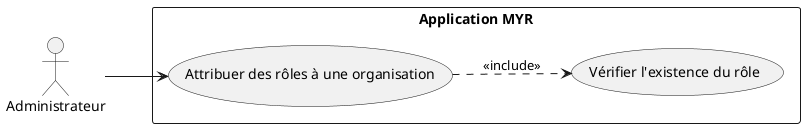
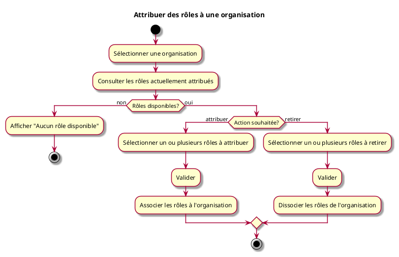

# Attribuer des rôles à une organisation

## Diagramme d'acteurs

## Contexte

Après qu'une organisation a été ajoutée au réseau (UCADM01), l'administrateur peut lui attribuer un ou plusieurs rôles. Un rôle détermine les droits et accès de l'organisation sur le réseau. Les rôles disponibles sont définis séparément (voir UCADM07).

L'administrateur peut également retirer un rôle d'une organisation à tout moment.

Le rôle administrateur est natif au système et ne peut pas être attribué à d'autres organisations via cette interface.

## Pré-conditions

- Être connecté en tant qu'administrateur du réseau
- L'organisation cible existe sur le réseau (UCADM01)
- Au moins un rôle disponible (autre que le rôle administrateur) — voir UCADM07

## Scénario

**Étape initiale :** L'administrateur accède à la fiche d'une organisation

### Flux nominal — Rôle(s) attribué(s)

1. Il sélectionne une organisation
2. Il consulte la liste des rôles actuellement attribués
3. Il sélectionne un ou plusieurs rôles à attribuer parmi les rôles disponibles
4. Il valide : les rôles sont associés à l'organisation

### Flux alternatif — Retrait d'un rôle

1. L'administrateur sélectionne une organisation
2. Il consulte la liste des rôles actuellement attribués
3. Il retire un ou plusieurs rôles
4. Il valide : les rôles sont dissociés de l'organisation

### Flux erreur — Aucun rôle disponible

1. Aucun rôle autre que le rôle administrateur n'existe
2. Le système affiche un message d'information
3. Message : `Aucun rôle disponible. Créez d'abord un rôle (voir Gestion des rôles).`

## Post-conditions

- L'organisation possède les rôles attribués, avec les droits associés
- Les droits effectifs de l'organisation reflètent l'union des droits de ses rôles

## Diagramme d'activités

