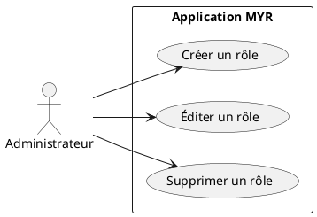
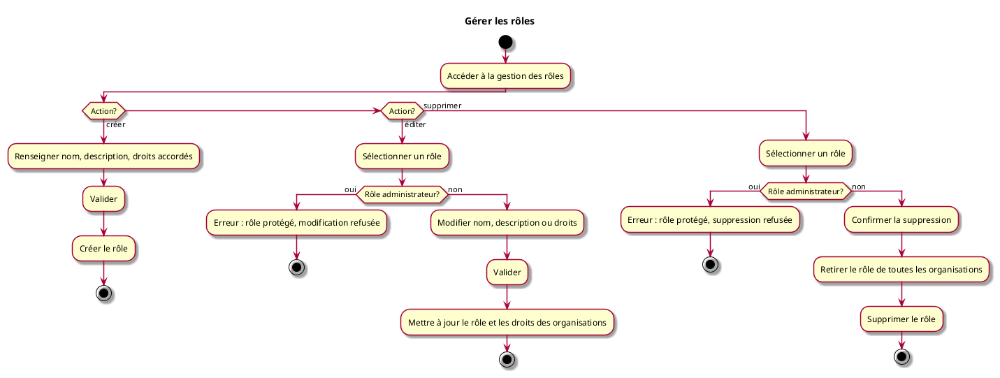

# Gérer les rôles

## Diagramme d'acteurs

## Contexte

L'administrateur gère les définitions de rôles disponibles sur le réseau. Un rôle regroupe un ensemble de droits et d'accès qui peuvent ensuite être attribués à des organisations (voir UCADM06).

Le rôle administrateur est natif au système : il ne peut pas être modifié ni supprimé.

## Pré-conditions

- Être connecté en tant qu'administrateur du réseau

## Scénario

**Étape initiale :** L'administrateur accède à la gestion des rôles

### Flux nominal — Rôle créé

1. Il clique sur "Créer un rôle"
2. Il renseigne : nom, description, liste des droits accordés
3. Il valide : le rôle est disponible pour attribution aux organisations (UCADM06)

### Flux nominal — Rôle édité

1. Il sélectionne un rôle existant (autre que le rôle administrateur)
2. Il modifie le nom, la description ou les droits accordés
3. Il valide : les organisations possédant ce rôle bénéficient immédiatement des droits mis à jour

### Flux nominal — Rôle supprimé

1. Il sélectionne un rôle existant (autre que le rôle administrateur)
2. Il confirme la suppression
3. Le rôle est retiré de toutes les organisations qui le possédaient, puis supprimé du système

### Flux erreur — Tentative de modification du rôle administrateur

1. L'administrateur tente d'éditer ou de supprimer le rôle administrateur
2. Le système refuse l'opération
3. Message : `Le rôle administrateur est protégé et ne peut pas être modifié ni supprimé.`

## Post-conditions

- **Création :** le nouveau rôle est disponible pour attribution (UCADM06)
- **Édition :** les organisations possédant ce rôle ont leurs droits mis à jour
- **Suppression :** le rôle est dissocié de toutes les organisations et supprimé du système

## Diagramme d'activités

