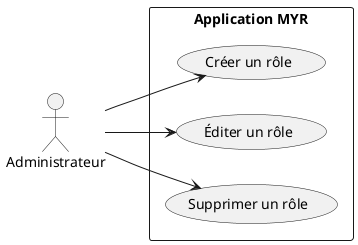
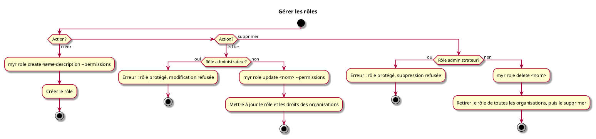

# Gérer les rôles

## Diagramme d'acteurs

## Contexte

L'administrateur gère les définitions de rôles disponibles sur le réseau. Un rôle regroupe un ensemble de droits et d'accès qui peuvent ensuite être attribués à des organisations (voir UCADM06).

Le rôle administrateur est natif au système : il ne peut pas être modifié ni supprimé.

## Pré-conditions

- Être connecté en tant qu'administrateur du réseau

## Scénario

**Étape initiale :** Sur le serveur (SSH), l'administrateur exécute une commande `myr role` (équivalent REST via le service domaine `role`)

### Flux nominal — Rôle créé

1. `myr role create --name <nom> --description <texte> --permissions <droits>` est exécutée
2. Le rôle est créé avec le nom, la description et la liste des droits accordés
3. Le rôle est disponible pour attribution aux organisations (UCADM06)

### Flux nominal — Rôle édité

1. `myr role update <nom> --permissions <droits>` est exécutée sur un rôle existant (autre que le rôle administrateur)
2. Le nom, la description ou les droits accordés sont mis à jour
3. Les organisations possédant ce rôle bénéficient immédiatement des droits mis à jour

### Flux nominal — Rôle supprimé

1. `myr role delete <nom>` est exécutée sur un rôle existant (autre que le rôle administrateur)
2. Le rôle est retiré de toutes les organisations qui le possédaient, puis supprimé du système

### Flux erreur — Tentative de modification du rôle administrateur

1. Une commande d'édition ou de suppression cible le rôle administrateur
2. Le système refuse l'opération
3. Message : `Le rôle administrateur est protégé et ne peut pas être modifié ni supprimé.`

## Post-conditions

- **Création :** le nouveau rôle est disponible pour attribution (UCADM06)
- **Édition :** les organisations possédant ce rôle ont leurs droits mis à jour
- **Suppression :** le rôle est dissocié de toutes les organisations et supprimé du système

## Diagramme d'activités

