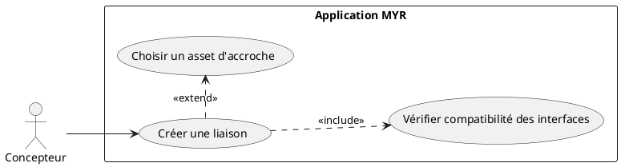
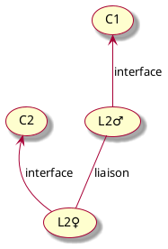
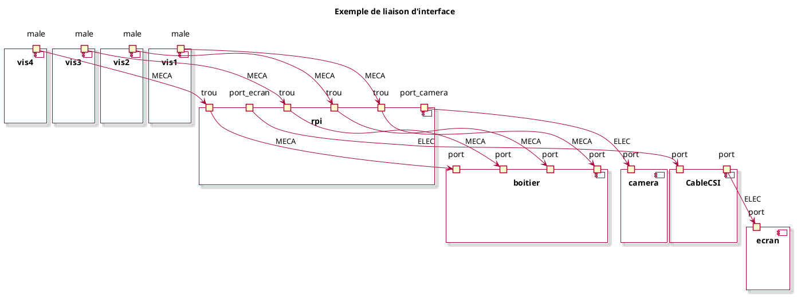
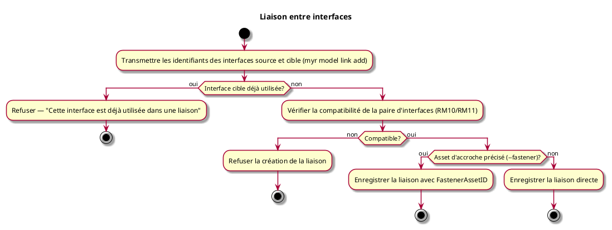

---
categorie: Assemblage Module
titre: "Liaison entre interfaces"
probabilite: 4
impact: 5
importance: 20
etat: relire
---

# Liaison entre interfaces

## Diagramme d'acteurs

## Contexte

Création de nouvelles interfaces d'un composant par la création de liaisons entre composants. Le composant doit garder ses interfaces créées par liaisons.

Une liaison peut être **directe** (les interfaces se connectent sans intermédiaire) ou **via un asset d'accroche** (vis, câble, connecteur…). L'asset d'accroche est lui-même un composant existant sur le réseau — son identifiant (`FastenerAssetID`) est enregistré sur la liaison. Voir UCAM07.

## Pré-conditions

- Être connecté au réseau
- Avoir au moins deux composants avec des interfaces existants
- Les interfaces à relier doivent être compatibles (catégorie, sens, tag, type, valeur)

## Scénario

**Étape initiale :** Sur le serveur (SSH), l'administrateur exécute `myr model link add --from <ifaceID_source> --to <ifaceID_cible> [--fastener <assetID>]` pour le compte du Concepteur — même effet via l'API REST équivalente (identifiants d'interfaces obtenus via `myr model interface list`, voir UCAM02)

### Flux nominal — Liaison directe

1. Les identifiants des interfaces source et cible sont transmis
2. Le service vérifie la compatibilité de la paire d'interfaces (catégorie, sens, tag, type, valeur — RM10/RM11)
3. Aucun asset d'accroche n'est précisé : la liaison est enregistrée directement (`FastenerAssetID` vide)
4. Les interfaces du composant résultant sont créées et conservées

### Flux nominal — Liaison via asset d'accroche

1. Étapes 1 à 2 identiques au flux nominal précédent
2. Un asset d'accroche est précisé (`--fastener <assetID>`, voir UCAM07)
3. La liaison est enregistrée avec le `FastenerAssetID` de l'asset choisi

### Flux erreur — Interfaces incompatibles

1. La paire d'interfaces transmise ne respecte pas les critères de compatibilité (RM10/RM11)
2. Le service refuse la création de la liaison — message d'erreur métier explicite

### Flux erreur — Interface déjà utilisée

1. L'interface cible est déjà engagée dans une liaison existante (RM09)
2. Le service refuse la création : "Cette interface est déjà utilisée dans une liaison"

### Flux — Liaison devenue incompatible après modification

Ce scénario survient lorsqu'un asset impliqué dans une liaison est remplacé par une version dont les interfaces ont changé (ex. : passage à une version améliorée avec un type de port différent).

1. La modification de l'asset est enregistrée
2. Le système détecte que la liaison existante n'est plus compatible avec les nouvelles interfaces
3. La liaison n'est **pas supprimée** — elle passe en état `incompatible`
4. Elle reste consultable, marquée `Incompatible: true`
5. Elle peut être supprimée manuellement, ou les assets peuvent être adaptés

## Post-conditions

- La liaison est enregistrée entre les deux composants
- Les interfaces libres du composant résultant sont visibles
- Une liaison devenue incompatible après modification reste présente, marquée `Incompatible: true` — elle n'est jamais supprimée automatiquement

## Diagrammes

### Principe d'une liaison entre deux interfaces compatibles

### Exemple concret — Raspberry Pi, caméra, écran, boitier

### Diagramme d'activités

