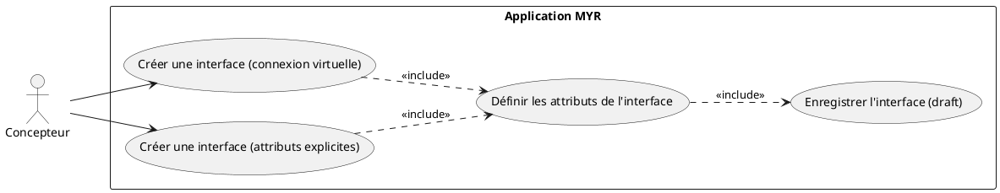
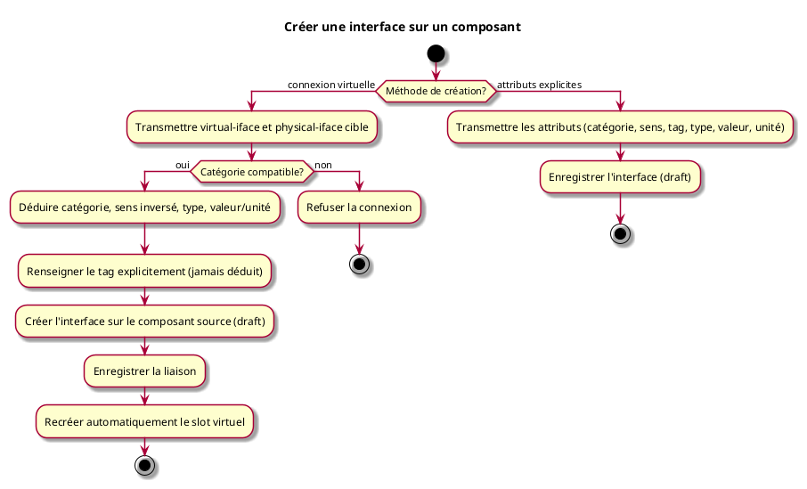

---
categorie: Assemblage Module
titre: "Créer une interface sur un composant"
probabilite: 3
impact: 5
importance: 15
etat: relu
---
# Créer une interface sur un composant

## Diagramme d'acteurs

## Contexte

Chaque composant possède toujours un **slot d'interface virtuel** (`Virtual=true`) : dès qu'un slot virtuel est matérialisé (relié à une interface physique existante), un nouveau slot virtuel est recréé automatiquement sur le composant (RM13).

Une interface peut être créée de deux façons :

- **Connexion depuis un slot virtuel** : le slot virtuel d'un composant est relié à une interface physique existante d'un autre composant. Le service déduit automatiquement la plupart des propriétés de la nouvelle interface à partir de la cible — seul le tag doit être renseigné explicitement.
- **Création manuelle** : tous les attributs de la nouvelle interface (catégorie, sens, tag, type, valeur/plage, unité) sont renseignés explicitement.

## Pré-conditions

- Être connecté au réseau
- Avoir au moins un composant existant
- Avoir les droits de création ou d'édition sur le composant (défini dans le rôle)

## Scénario

### Flux nominal A — Connexion depuis un slot virtuel (déduction automatique)

**Étape initiale :** `myr model link connect-virtual --virtual-iface <id> --physical-iface <id>` est exécutée (ou l'appel API équivalent)

1. Le service déduit les propriétés de la nouvelle interface à partir de la cible :
   - **catégorie** : identique à la cible
   - **sens** : inversé (sortie → entrée ; entrée → sortie ; bidirectionnel → bidirectionnel)
   - **type** : identique à la cible
   - **valeur/unité** : inférée depuis la cible (ex : cible sortie 3–6 V → nouvelle interface entrée 3,3 V)
2. Le tag doit être renseigné explicitement (`--tag <tag>`) — jamais déduit
3. La nouvelle interface est créée sur le composant source (état draft)
4. La liaison est enregistrée
5. Le slot virtuel est automatiquement recréé sur le composant (RM13)

### Flux nominal B — Création manuelle avec attributs explicites

**Étape initiale :** `myr model interface add <assetID> --category <cat> --type <type> --direction <in|out|bidir> [--value-min --value-max --unit] --tag <tag> [--name <label>]` est exécutée

1. L'interface est créée et enregistrée dans l'état draft

### Flux alternatif A2 — Ajustement des valeurs déduites

1. Les valeurs déduites (flux A) sont surchargées par des flags explicites avant validation (ex : affiner la plage de valeur)
2. L'interface est créée avec les valeurs ajustées

### Flux erreur — Incompatibilité de connexion virtuelle

1. Le service détecte une incompatibilité entre le slot virtuel et l'interface physique ciblée (catégories différentes)
2. La connexion est refusée

## Post-conditions

- La nouvelle interface est enregistrée sur le composant
- Le slot d'interface virtuel reste disponible sur le composant (`Virtual=true` recréé)
- La liaison est enregistrée (si flux A)

## Diagramme d'activités

