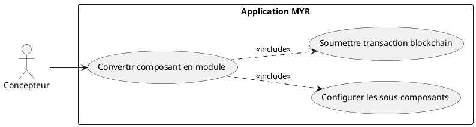
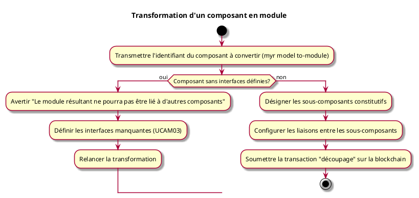

---
categorie: Assemblage Module
titre: "Transformation d'un composant en module"
probabilite: 1
impact: 4
importance: 4
etat: relire
---

# Transformation d'un composant en module

## Diagramme d'acteurs

## Contexte

Un composant existant peut être converti en module s'il est redécoupé en sous-systèmes indépendants. Cette opération correspond à la catégorie **découpage** dans la taxonomie des assets.

## Pré-conditions

- Être connecté au réseau
- Être propriétaire du composant à convertir
- Avoir les droits d'édition

## Scénario

**Étape initiale :** Sur le serveur (SSH), l'administrateur exécute `myr model to-module <assetID> --name <nom>` pour le compte du Concepteur (ou l'appel API équivalent)

### Flux nominal — Conversion réussie

1. Les sous-composants constitutifs sont désignés
2. Les liaisons entre les sous-composants sont configurées (voir UCAM01)
3. La transaction "découpage" est soumise sur la blockchain

### Flux alternatif — Composant sans interfaces définies

1. Le composant ciblé ne possède aucune interface définie
2. Le service avertit : "Ce composant n'a pas d'interfaces — le module résultant ne pourra pas être lié à d'autres composants"
3. Les interfaces doivent être définies avant de poursuivre (voir UCAM03)
4. Une fois les interfaces définies, la transformation en module peut être relancée normalement

## Post-conditions

- Le composant est transformé en module contenant ses sous-composants
- Les interfaces du module correspondent aux interfaces libres des sous-composants

## Diagramme d'activités

