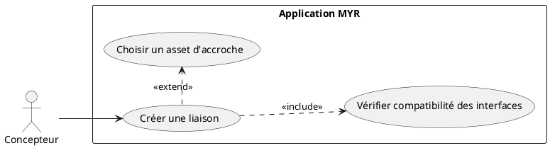
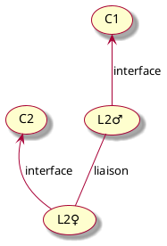
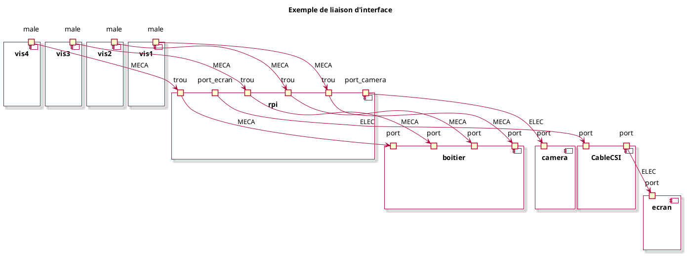
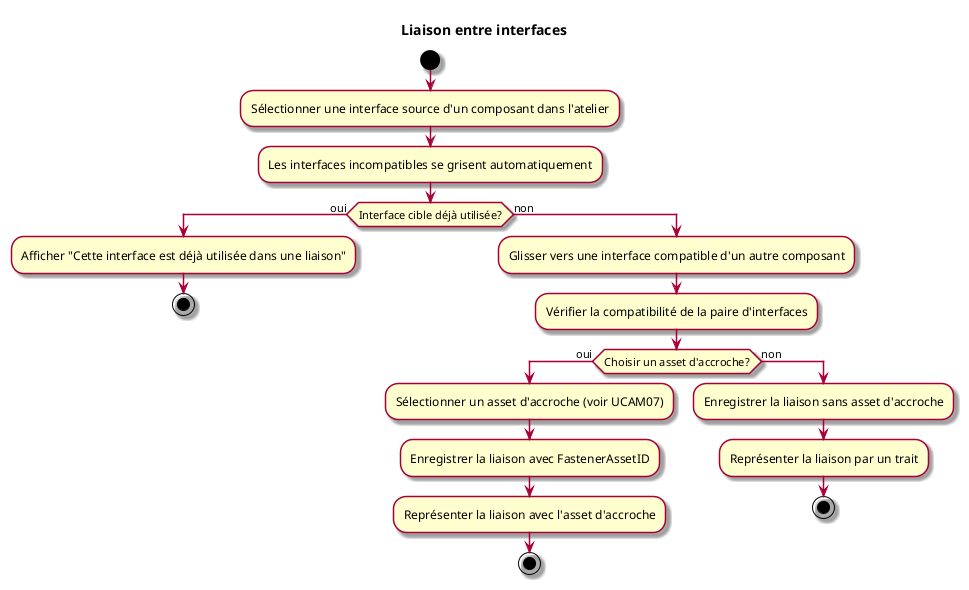

---
categorie: Atelier Module
titre: "Liaison entre interfaces"
probabilite: 4
impact: 5
importance: 20
etat: relire
---

# Liaison entre interfaces

## Diagramme d'acteurs

## Contexte

Création de nouvelles interfaces d'un composant par la création de liaisons entre composants. Le composant doit garder ses interfaces créées par liaisons.

Une liaison peut être **directe** (les interfaces se connectent sans intermédiaire) ou **via un asset d'accroche** (vis, câble, connecteur…). L'asset d'accroche est lui-même un composant existant sur le réseau — son identifiant (`FastenerAssetID`) est enregistré sur la liaison. Voir UCAM07.

## Pré-conditions

- Être connecté au réseau
- Avoir au moins deux composants avec des interfaces dans l'atelier
- Les interfaces à relier doivent être compatibles (type, sens, valeur)

## Scénario

**Étape initiale :** L'utilisateur sélectionne une interface d'un composant dans l'atelier

### Flux nominal — Liaison directe

1. L'utilisateur glisse l'interface vers une interface compatible d'un autre composant
2. Les interfaces non compatibles se grisent pour guider l'utilisateur
3. Le système vérifie la compatibilité de la paire d'interfaces
4. Le système propose optionnellement de choisir un asset d'accroche (voir UCAM07) — l'utilisateur peut ignorer
5. La liaison est enregistrée sans asset d'accroche (`FastenerAssetID` vide)
6. La liaison est représentée par un trait entre les deux interfaces
7. Les interfaces du composant résultant sont créées et conservées

### Flux nominal — Liaison via asset d'accroche

1. Étapes 1 à 3 identiques au flux nominal précédent
2. L'utilisateur choisit de sélectionner un asset d'accroche (voir UCAM07)
3. La liaison est enregistrée avec le `FastenerAssetID` de l'asset choisi
4. La liaison est représentée par un trait incluant l'asset d'accroche

### Comportement à la sélection — Interfaces non compatibles

Les interfaces incompatibles ne constituent pas un flux d'erreur à la création : l'interface graphique les prévient en amont.

1. Dès que l'utilisateur sélectionne une interface source, toutes les interfaces incompatibles se grisent automatiquement
2. Seules les interfaces compatibles restent cliquables
3. Il est donc impossible de créer une liaison incompatible via l'interface graphique

### Flux erreur — Interface déjà utilisée

1. Si l'interface cible est déjà engagée dans une liaison existante, elle est grisée
2. En cas de tentative forcée, le système affiche : "Cette interface est déjà utilisée dans une liaison"

### Flux — Liaison devenue incompatible après modification

Ce scénario survient lorsqu'un asset impliqué dans une liaison est remplacé par une version dont les interfaces ont changé (ex. : passage à une version améliorée avec un type de port différent).

1. La modification de l'asset est enregistrée
2. Le système détecte que la liaison existante n'est plus compatible avec les nouvelles interfaces
3. La liaison n'est **pas supprimée** — elle passe en état `incompatible`
4. Elle reste visible dans l'atelier, représentée en rouge
5. L'utilisateur peut choisir de la supprimer manuellement ou d'adapter les assets

## Post-conditions

- La liaison est enregistrée entre les deux composants
- Les interfaces libres du composant résultant sont visibles
- Une liaison devenue incompatible après modification reste présente, marquée en rouge (`Incompatible: true`) — elle n'est jamais supprimée automatiquement

## Diagrammes

### Principe d'une liaison entre deux interfaces compatibles

### Exemple concret — Raspberry Pi, caméra, écran, boitier

### Diagramme d'activités

