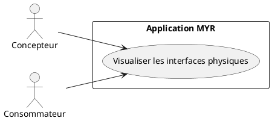
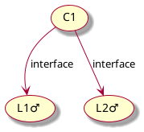
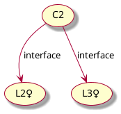
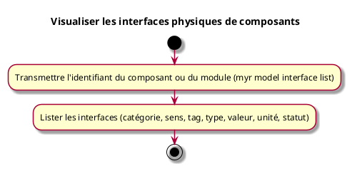

---
categorie: Atelier Module
titre: "Visualiser les interfaces physiques de composants"
probabilite: 3
impact: 5
importance: 15
---

# Visualiser les interfaces physiques de composants

## Diagramme d'acteurs

## Contexte

Un client peut lister les interfaces physiques (mécaniques, électriques, hydrauliques, etc.) d'un composant ou d'un module.

## Pré-conditions

- Être connecté au réseau
- Connaître l'identifiant du composant ou du module (asset ou module)

## Scénario

**Étape initiale :** `myr model interface list <assetID>` est exécutée (le composant peut aussi être un module, via la même commande) — même effet via l'API REST équivalente

### Flux nominal — Affichage des interfaces physiques

1. Les interfaces physiques du composant ou du module sont listées
2. Chaque ligne du résultat détaille : identifiant, catégorie, type, sens, valeur/plage, unité, et statut (virtuelle/utilisée)

## Post-conditions

- Les interfaces physiques du composant sont visibles et lisibles

## Diagrammes

### Composant C1 — interfaces L1♂ et L2♂

### Composant C2 — interfaces L2♀ et L3♀

Les interfaces L2♂ (sur C1) et L2♀ (sur C2) sont compatibles et peuvent être reliées par une liaison.

### Diagramme d'activités

