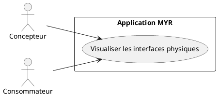
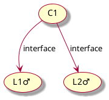
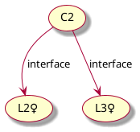
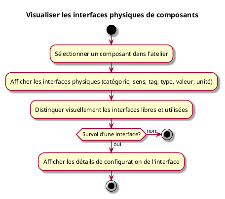

---
categorie: Atelier Module
titre: "Visualiser les interfaces physiques de composants"
probabilite: 3
impact: 5
importance: 15
---

# Visualiser les interfaces physiques de composants

## Diagramme d'acteurs

## Contexte

L'utilisateur peut visualiser les interfaces physiques (mécaniques, électriques, hydrauliques, etc.) d'un composant dans l'atelier.

## Pré-conditions

- Être connecté au réseau
- Avoir au moins un composant sélectionné dans l'atelier

## Scénario

**Étape initiale :** L'utilisateur sélectionne un composant dans l'atelier

### Flux nominal — Affichage des interfaces physiques

1. Les interfaces physiques du composant s'affichent (catégorie, sens, tag, type, valeur, unité)
2. Les interfaces libres et celles déjà utilisées sont distinguées visuellement
3. En survolant une interface, ses détails de configuration s'affichent

## Post-conditions

- Les interfaces physiques du composant sont visibles et lisibles

## Diagrammes

### Composant C1 — interfaces L1♂ et L2♂

### Composant C2 — interfaces L2♀ et L3♀

Les interfaces L2♂ (sur C1) et L2♀ (sur C2) sont compatibles et peuvent être reliées par une liaison.

### Diagramme d'activités

