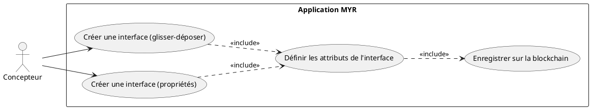
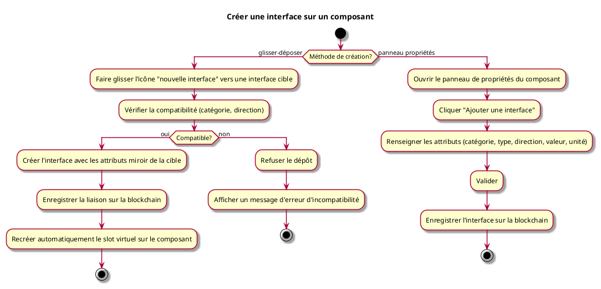

---
categorie: Atelier Module
titre: "Créer une interface sur un composant"
probabilite: 3
impact: 5
importance: 15
etat: relire
---

# Créer une interface sur un composant

## Diagramme d'acteurs

## Contexte

Chaque composant affiché dans l'atelier porte une **icône "nouvelle interface"** (slot `Virtual=true`). Cet élément est toujours présent : dès qu'un slot virtuel est matérialisé, un nouveau prend sa place automatiquement.

L'utilisateur peut créer une interface de deux façons :

- **Glisser-déposer** : faire glisser l'icône "nouvelle interface" d'un composant vers une interface existante d'un autre composant. L'interface est définie par la cible (type, direction, unité).
- **Propriétés** : ouvrir le panneau de propriétés de l'asset et renseigner manuellement les attributs de la nouvelle interface.

## Pré-conditions

- Être connecté au réseau
- Avoir au moins un composant dans l'atelier
- Avoir les droits d'édition sur le composant

## Scénario

### Flux nominal A — Glisser-déposer depuis l'icône

**Étape initiale :** L'utilisateur fait glisser l'icône "nouvelle interface" d'un composant vers une interface physique d'un autre composant

1. Le système détecte le glisser-déposer vers une interface cible
2. Il vérifie la compatibilité (catégorie, direction)
3. Si compatible : la nouvelle interface est créée sur le composant source avec les attributs miroir de la cible
4. La liaison entre les deux interfaces est enregistrée sur la blockchain
5. L'icône "nouvelle interface" est automatiquement recréée sur le composant (slot virtuel maintenu)

### Flux nominal B — Via le panneau propriétés

**Étape initiale :** L'utilisateur ouvre le panneau de propriétés d'un composant et clique "Ajouter une interface"

1. Un formulaire s'affiche (catégorie, type, direction, valeur/plage, unité)
2. L'utilisateur renseigne les attributs et valide
3. L'interface est créée et enregistrée sur la blockchain

### Flux erreur — Incompatibilité au glisser-déposer

1. Le système détecte une incompatibilité (catégories différentes, directions incompatibles)
2. Le dépôt est refusé, un message d'erreur s'affiche

## Post-conditions

- La nouvelle interface est enregistrée sur le composant
- L'icône "nouvelle interface" reste disponible sur le composant (slot `Virtual=true` recréé)
- La liaison est visible dans l'atelier (si flux A)

## Diagramme d'activités

