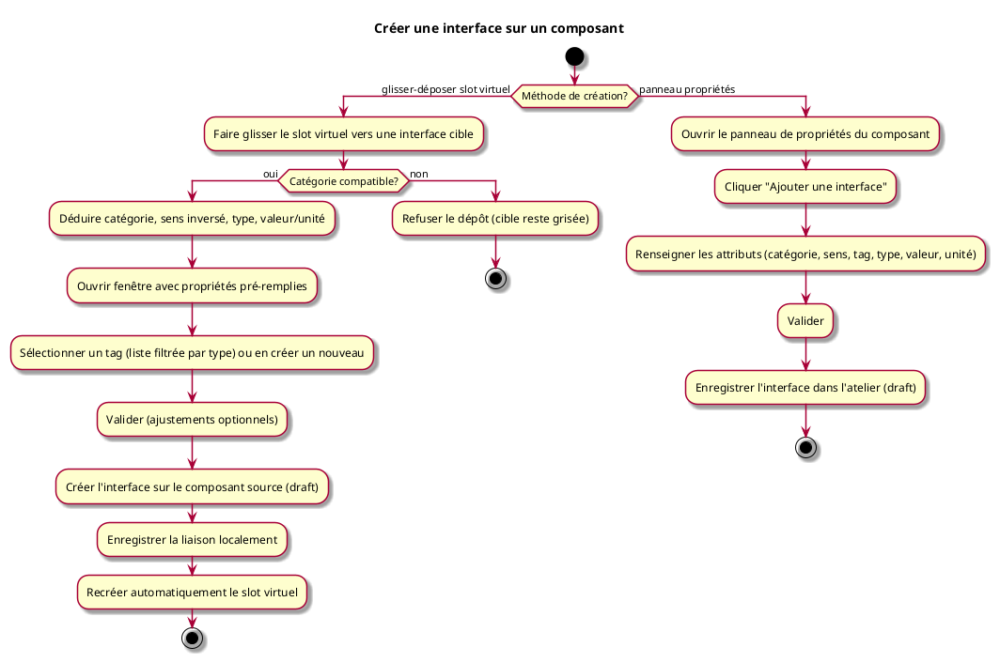

---
categorie: Atelier Module
titre: "Créer une interface sur un composant"
probabilite: 3
impact: 5
importance: 15
etat: relu
---
# Créer une interface sur un composant

## Diagramme d'acteurs

## Contexte

Chaque composant affiché dans l'atelier porte une **icône "nouvelle interface"** (slot `Virtual=true`). Cet élément est toujours présent : dès qu'un slot virtuel est matérialisé, un nouveau prend sa place automatiquement.

L'utilisateur peut créer une interface de deux façons :

- **Glisser-déposer** : faire glisser l'icône "nouvelle interface" (slot virtuel) d'un composant vers une interface existante d'un autre composant. Le système déduit les propriétés de la nouvelle interface à partir de la cible et ouvre une fenêtre de confirmation pré-remplie. Le tag doit être sélectionné par l'utilisateur depuis une liste filtrée ou créé.
- **Propriétés** : ouvrir le panneau de propriétés de l'asset et renseigner manuellement tous les attributs de la nouvelle interface.

## Pré-conditions

- Être connecté au réseau
- Avoir au moins un composant dans l'atelier
- Avoir les droits de création ou d'édition sur le composant (défini dans le rôle)

## Scénario

### Flux nominal A — Glisser-déposer depuis le slot virtuel

**Étape initiale :** L'utilisateur fait glisser l'icône "nouvelle interface" (slot `Virtual=true`) d'un composant vers une interface physique d'un autre composant

1. Le système détecte le dépôt sur une interface cible existante
2. Il déduit les propriétés de la nouvelle interface à partir de la cible :
   - **catégorie** : identique à la cible
   - **sens** : inversé (sortie → entrée ; entrée → sortie ; bidirectionnel → bidirectionnel)
   - **type** : identique à la cible
   - **valeur/unité** : inférée depuis la cible (ex : cible sortie 3–6 V → nouvelle interface entrée 3,3 V)
3. Une fenêtre s'ouvre avec les propriétés déduites pré-remplies (catégorie, sens, type, valeur, unité)
4. Le champ **tag** est vide — l'utilisateur doit sélectionner un tag depuis la liste filtrée par type ou en créer un nouveau
5. L'utilisateur valide (ou ajuste les valeurs avant de valider)
6. La nouvelle interface est créée sur le composant source dans l'atelier (état draft)
7. La liaison est enregistrée localement dans l'atelier
8. L'icône "nouvelle interface" est automatiquement recréée sur le composant (slot virtuel maintenu)

### Flux nominal B — Via le panneau propriétés

**Étape initiale :** L'utilisateur ouvre le panneau de propriétés d'un composant et clique "Ajouter une interface"

1. Un formulaire s'affiche (catégorie, sens, tag, type, valeur/plage, unité)
2. L'utilisateur renseigne les attributs et valide
3. L'interface est créée et enregistrée localement dans l'atelier (état draft)

### Flux alternatif A2 — Ajustement des valeurs déduites

1. L'utilisateur modifie une ou plusieurs valeurs pré-remplies dans la fenêtre (ex : affiner la plage de valeur)
2. La validation crée l'interface avec les valeurs ajustées

### Flux erreur — Incompatibilité au glisser-déposer

1. Le système détecte une incompatibilité (catégories différentes)
2. Le dépôt est refusé visuellement (l'interface cible reste grisée, pas de fenêtre)

## Post-conditions

- La nouvelle interface est enregistrée sur le composant
- L'icône "nouvelle interface" reste disponible sur le composant (slot `Virtual=true` recréé)
- La liaison est visible dans l'atelier (si flux A)

## Diagramme d'activités

