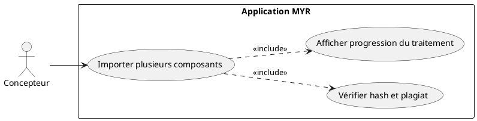
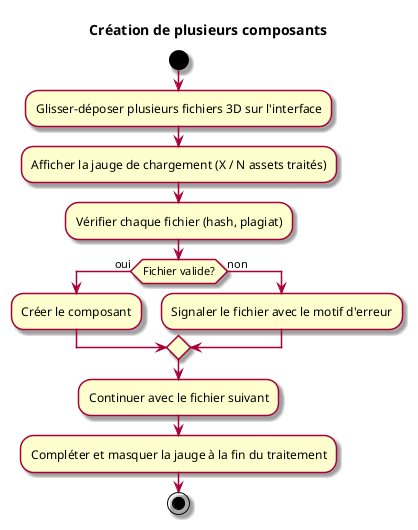

---
categorie: Atelier Module
titre: "Création de plusieurs composants"
probabilite: 4
impact: 2
importance: 8
---

# Création de plusieurs composants

## Diagramme d'acteurs

## Contexte

Ajout de plusieurs fichiers 3D en glissant-déposant pour la création de nouveaux composants en une seule opération.

## Pré-conditions

- Être connecté au réseau
- Avoir les droits de création de composants
- Disposer de fichiers 3D/CAO à importer

## Scénario

**Étape initiale :** L'utilisateur glisse-dépose plusieurs fichiers 3D sur l'interface

### Flux nominal — Import multiple réussi

1. Une jauge de chargement apparaît avec le nombre d'assets traités sur le total
2. Pour chaque fichier, les assets sont vérifiés (hash, plagiat)
3. Un composant est créé pour chaque fichier valide
4. La jauge se complète et disparaît à la fin du traitement

### Flux erreur — Fichier invalide ou plagiat détecté

1. Le fichier concerné est signalé avec le motif d'erreur
2. Les autres fichiers continuent d'être traités

## Post-conditions

- Les composants valides sont créés et disponibles dans la bibliothèque
- Les fichiers en erreur sont signalés à l'utilisateur

## Diagramme d'activités

