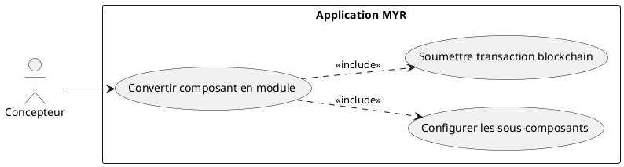
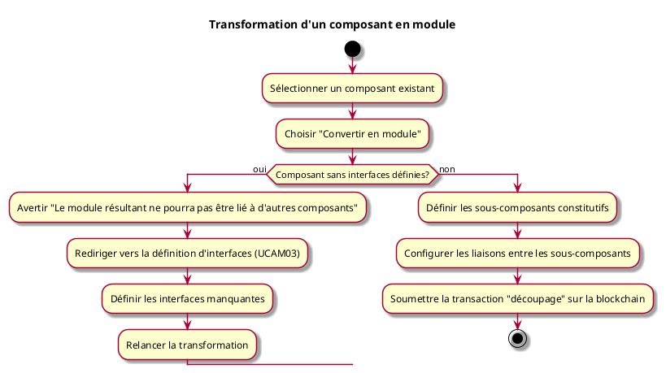

---
categorie: Atelier Module
titre: "Transformation d'un composant en module"
probabilite: 1
impact: 4
importance: 4
etat: relire
---

# Transformation d'un composant en module

## Diagramme d'acteurs

## Contexte

Un composant existant peut être converti en module s'il est redécoupé en sous-systèmes indépendants. Cette opération correspond à la catégorie **découpage** dans la taxonomie des assets.

## Pré-conditions

- Être connecté au réseau
- Être propriétaire du composant à convertir
- Avoir les droits d'édition

## Scénario

**Étape initiale :** L'utilisateur sélectionne un composant existant

### Flux nominal — Conversion réussie

1. L'utilisateur choisit "Convertir en module"
2. Il définit les sous-composants constitutifs
3. Il configure les liaisons entre les sous-composants
4. La transaction "découpage" est soumise sur la blockchain

### Flux alternatif — Composant sans interfaces définies

1. Le composant sélectionné ne possède aucune interface définie
2. Le système avertit : "Ce composant n'a pas d'interfaces — le module résultant ne pourra pas être lié à d'autres composants"
3. L'utilisateur choisit de définir les interfaces avant de poursuivre (voir UCAM03)
4. Une fois les interfaces définies, la transformation en module est relancée normalement

## Post-conditions

- Le composant est transformé en module contenant ses sous-composants
- Les interfaces du module correspondent aux interfaces libres des sous-composants

## Diagramme d'activités

