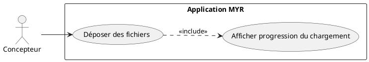
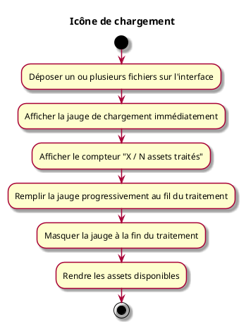

---
categorie: Atelier Module
titre: "Icône de chargement"
probabilite: 4
impact: 2
---

# Icône de chargement

## Diagramme d'acteurs

## Contexte

Lors d'un drag and drop de fichier(s), tous les assets sont demandés en vérification puis une jauge de chargement se crée (avec nombre chargés / nombre total) pour faire patienter l'utilisateur.

## Pré-conditions

- Avoir initié un drag and drop de fichier(s) sur l'interface

## Scénario

**Étape initiale :** L'utilisateur dépose un ou plusieurs fichiers sur l'interface

### Flux nominal — Chargement en cours

1. Une jauge de chargement apparaît immédiatement
2. Le compteur affiche "X / N assets traités"
3. La jauge se remplit progressivement
4. À la fin, la jauge disparaît et les assets sont disponibles

## Post-conditions

- Tous les assets sont chargés et disponibles
- L'utilisateur a été informé de la progression

## Diagramme d'activités

