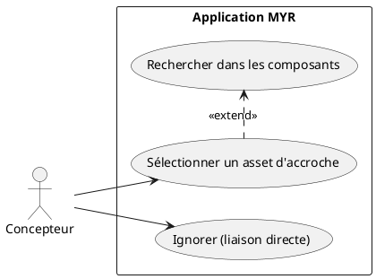
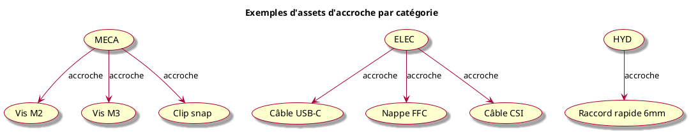
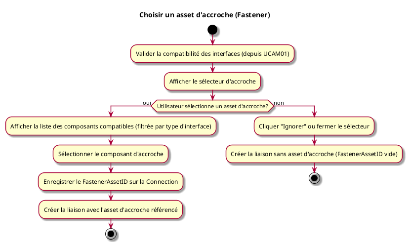

---
categorie: Atelier Module
titre: "Choisir un asset d'accroche (Fastener)"
probabilite: 3
impact: 3
importance: 9
etat: relire
---

# Choisir un asset d'accroche (Fastener)

## Diagramme d'acteurs

## Contexte

Lors de la création d'une liaison (voir UCAM01), le système propose optionnellement de désigner un **asset d'accroche** : un composant existant sur le réseau qui sert d'intermédiaire physique entre les deux interfaces (vis, câble, connecteur, raccord…).

L'identifiant de cet asset (`FastenerAssetID`) est enregistré sur la `Connection`. Si l'utilisateur ignore cette étape, `FastenerAssetID` reste vide et la liaison est directe.

## Pré-conditions

- Être en cours de création d'une liaison (UCAM01)
- Avoir des composants disponibles sur le réseau (potentiels fasteners)

## Scénario

**Étape initiale :** Le système affiche le sélecteur d'accroche après validation de la compatibilité des interfaces

### Flux nominal — Asset d'accroche sélectionné

1. Le système affiche la liste des composants utilisables comme accroche (filtrée par compatibilité de type d'interface)
2. L'utilisateur sélectionne le composant d'accroche (ex : vis M3, câble USB-C)
3. Le `FastenerAssetID` est enregistré sur la `Connection`
4. La liaison est créée avec l'asset d'accroche référencé

### Flux nominal — Liaison directe (accroche ignorée)

1. L'utilisateur clique "Ignorer" ou ferme le sélecteur
2. La liaison est créée sans asset d'accroche (`FastenerAssetID` vide)

## Post-conditions

- La `Connection` est enregistrée avec ou sans `FastenerAssetID`
- Si un fastener est sélectionné, il apparaît visuellement sur la liaison dans l'atelier

## Diagrammes

### Types d'accroche selon la catégorie d'interface

### Diagramme d'activités

