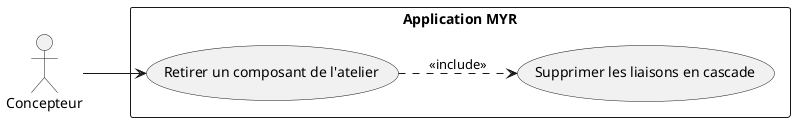
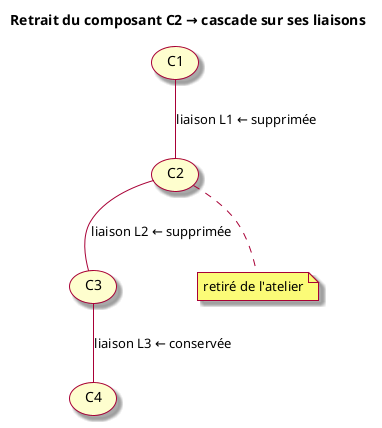
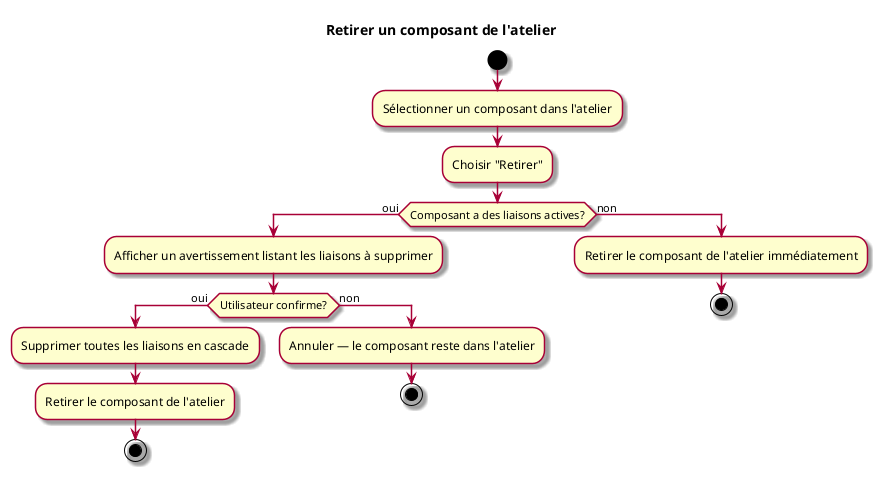

---
categorie: Atelier Module
titre: "Retirer un composant de l'atelier"
probabilite: 4
impact: 4
importance: 16
etat: relire
---

# Retirer un composant de l'atelier

## Diagramme d'acteurs

## Contexte

L'utilisateur peut retirer un composant ou un module de son espace de travail (atelier). Cette opération supprime **uniquement l'instance locale** : le composant reste disponible sur le réseau blockchain et peut être rajouté à tout moment.

Toutes les liaisons impliquant cette instance sont supprimées automatiquement en cascade — elles ne peuvent pas rester orphelines dans l'atelier.

## Pré-conditions

- Être dans l'atelier
- Avoir au moins un composant sélectionné dans l'atelier

## Scénario

**Étape initiale :** L'utilisateur sélectionne un composant dans l'atelier et choisit "Retirer"

### Flux nominal — Retrait sans liaisons actives

1. Le composant n'a aucune liaison dans l'atelier
2. Le composant est retiré de l'atelier immédiatement

### Flux nominal — Retrait avec liaisons en cascade

1. Le composant possède des liaisons avec d'autres composants dans l'atelier
2. Le système affiche un avertissement listant les liaisons qui seront supprimées
3. L'utilisateur confirme le retrait
4. Toutes les liaisons impliquant ce composant sont supprimées en cascade
5. Le composant est retiré de l'atelier

### Flux erreur — Refus de confirmation

1. L'utilisateur annule à l'étape de confirmation
2. Aucune modification n'est effectuée — le composant reste dans l'atelier

## Post-conditions

- Le composant n'est plus visible dans l'atelier
- Toutes ses liaisons sont supprimées (cascade)
- Le composant reste disponible sur le réseau et peut être réajouté (voir UCMOD02)
- **Aucune transaction blockchain n'est émise** — Fabric ne supporte pas la suppression d'asset

## Diagramme

### Effet cascade sur les liaisons

### Diagramme d'activités

