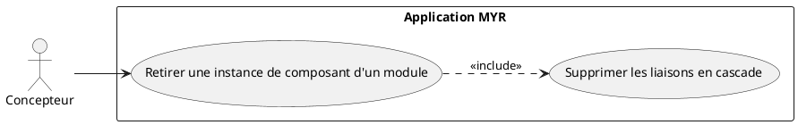
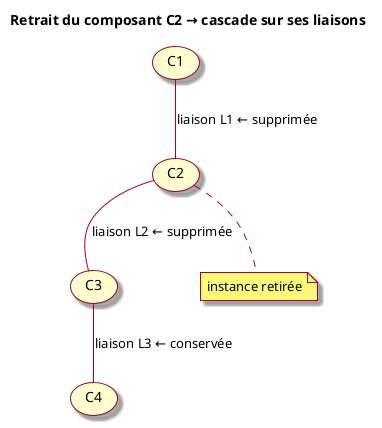
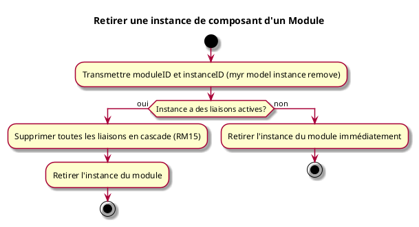

---
categorie: Atelier Module
titre: "Retirer une instance de composant d'un Module"
probabilite: 4
impact: 4
importance: 16
etat: relire
---

# Retirer une instance de composant d'un Module

## Diagramme d'acteurs

## Contexte

Une instance de composant ou de module ajoutée à un module hôte peut en être retirée par une action directe (`RemoveAssetFromWorkspace` au niveau du domaine). Cette opération supprime **uniquement l'instance** : le composant reste disponible sur le réseau blockchain et peut être rajouté à tout moment.

Toutes les liaisons impliquant cette instance sont supprimées automatiquement en cascade — elles ne peuvent pas rester orphelines.

## Pré-conditions

- Connaître l'identifiant du module hôte et de l'instance à retirer (`myr module get <id>` pour lister ses instances)

## Scénario

**Étape initiale :** `myr model instance remove <moduleID> <instanceID>` est exécutée (ou l'appel API équivalent), sans étape de confirmation interactive

### Flux nominal — Retrait sans liaisons actives

1. L'instance ciblée n'a aucune liaison enregistrée
2. Elle est retirée immédiatement du module

### Flux nominal — Retrait avec liaisons en cascade

1. L'instance ciblée possède des liaisons avec d'autres instances du module
2. Toutes les liaisons impliquant cette instance sont supprimées en cascade (RM15)
3. L'instance est retirée du module

## Post-conditions

- Le composant n'est plus une instance du module hôte
- Toutes ses liaisons sont supprimées (cascade)
- Le composant reste disponible sur le réseau et peut être réajouté (voir UCMOD02)
- **Aucune transaction blockchain n'est émise** — Fabric ne supporte pas la suppression d'asset

## Diagramme

### Effet cascade sur les liaisons

### Diagramme d'activités

