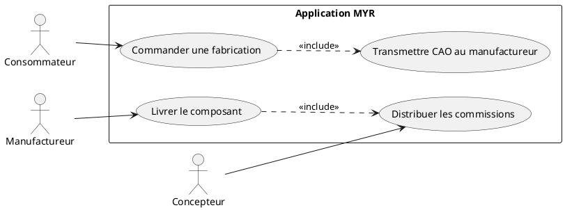
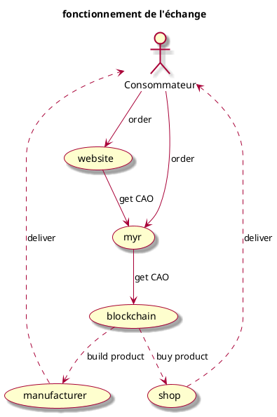
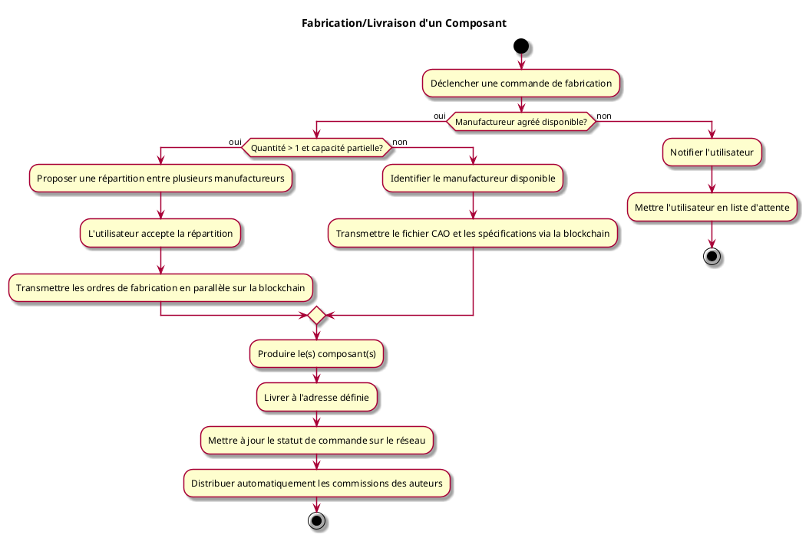

---
categorie: Automatisation
titre: "Fabrication/Livraison d'un Composant"
probabilite: 5
impact: 4
importance: 20
etat: relire
---

# Fabrication/Livraison d'un Composant

## Diagramme d'acteurs

## Contexte

Passage par un fabricant externe agréé par le réseau qui se chargera de créer et livrer le(s) composant(s) à l'adresse définie.

Conformément au principe de parité CLI/REST (CLAUDE.md), la confirmation de livraison par un manufactureur (et la distribution automatique des commissions qui s'ensuit) doit être déclenchable en CLI pour son compte, au même titre que via l'interface graphique ou l'API REST.

## Pré-conditions

- Être connecté au réseau
- Composant commandé avec fichier CAO disponible sur la blockchain
- Manufactureur agréé disponible sur le réseau
- Adresse de livraison renseignée

## Scénario

**Étape initiale :** Une commande de fabrication est déclenchée

### Flux nominal — Fabrication et livraison réussies

1. Le système identifie le manufactureur agréé disponible
2. Le fichier CAO et les spécifications sont transmis via la blockchain
3. Le manufactureur produit le composant
4. Le composant est livré à l'adresse définie
5. Le statut de commande est mis à jour sur le réseau

### Flux alternatif — Commande en lot (quantité > 1)

1. Le consommateur saisit une quantité supérieure à 1 dans sa commande
2. Le système vérifie si la capacité de fabrication disponible peut absorber le lot
3. Si la capacité est suffisante chez un seul manufactureur : la commande est acceptée comme lot unique
4. Si la capacité est partielle : le système propose de répartir la commande entre plusieurs manufactureurs
5. L'utilisateur accepte la répartition
6. Les ordres de fabrication sont transmis en parallèle sur la blockchain à chaque manufactureur concerné

### Flux erreur — Aucun manufactureur disponible

1. L'utilisateur est notifié et mis en liste d'attente

## Post-conditions

- Le composant est fabriqué et livré
- La commande est enregistrée sur la blockchain
- Les commissions des auteurs sont distribuées automatiquement

## Diagrammes

### Flux de commande — boutique partenaire ou API MYR vers manufactureur

### Diagramme d'activités

