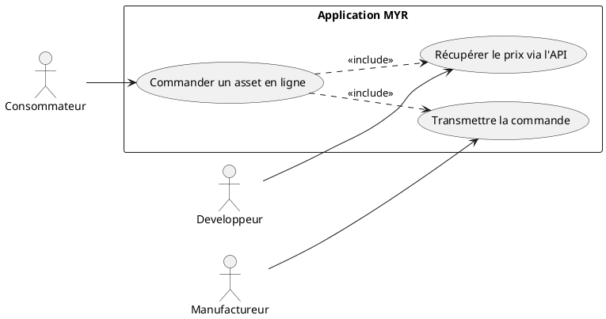
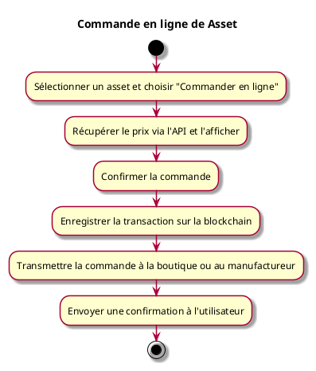

---
categorie: Automatisation
titre: "Commande en ligne de Asset"
probabilite: 5
impact: 3
importance: 15
etat: relire
---

# Commande en ligne de asset

## Diagramme d'acteurs

## Contexte

Commande en ligne d'un asset via l'interface MYR ou une boutique partenaire avec récupération du prix via l'API.

## Pré-conditions

- Être connecté au réseau
- asset disponible à la commande
- Adresse de livraison renseignée

## Scénario

**Étape initiale :** L'utilisateur sélectionne un asset et choisit "Commander en ligne"

### Flux nominal — Commande passée

1. Le système récupère le prix via l'API et l'affiche à l'utilisateur
2. L'utilisateur confirme la commande
3. La transaction est enregistrée sur la blockchain
4. La commande est transmise à la boutique ou au manufactureur

## Post-conditions

- La commande est enregistrée et en cours de traitement
- L'utilisateur reçoit une confirmation

## Diagramme d'activités

