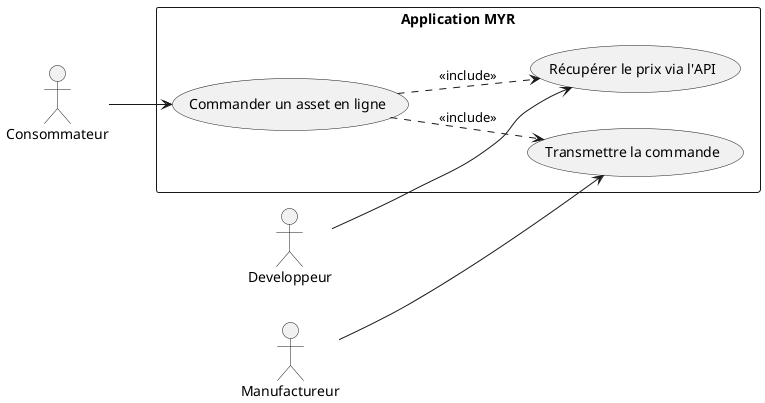
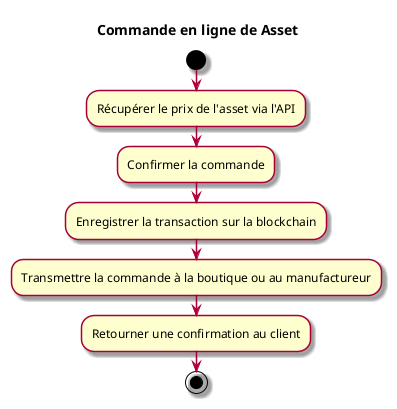

---
categorie: Automatisation
titre: "Commande en ligne de Asset"
probabilite: 5
impact: 3
importance: 15
etat: relire
---

# Commande en ligne de asset

## Diagramme d'acteurs

## Contexte

Commande en ligne d'un asset via l'interface MYR ou une boutique partenaire avec récupération du prix via l'API.

Conformément au principe de parité CLI/REST, une commande passée par une boutique partenaire via l'API doit pouvoir être reproduite en CLI pour le compte d'un consommateur, au même titre que via l'interface graphique.

## Pré-conditions

- Être connecté au réseau
- asset disponible à la commande
- Adresse de livraison renseignée

## Scénario

**Étape initiale :** Un client (boutique partenaire, script, interface graphique tierce...) appelle l'API pour commander un asset

### Flux nominal — Commande passée

1. Le prix de l'asset est récupéré via l'API
2. La commande est confirmée par le client
3. La transaction est enregistrée sur la blockchain
4. La commande est transmise à la boutique ou au manufactureur

## Post-conditions

- La commande est enregistrée et en cours de traitement
- L'utilisateur reçoit une confirmation

## Diagramme d'activités

