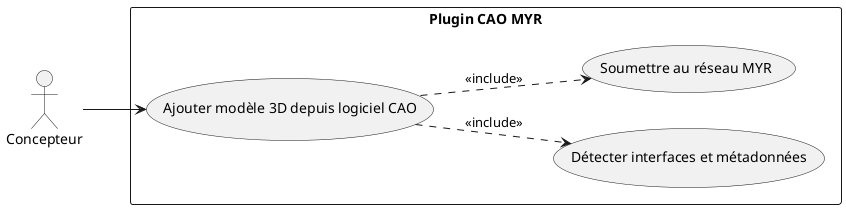
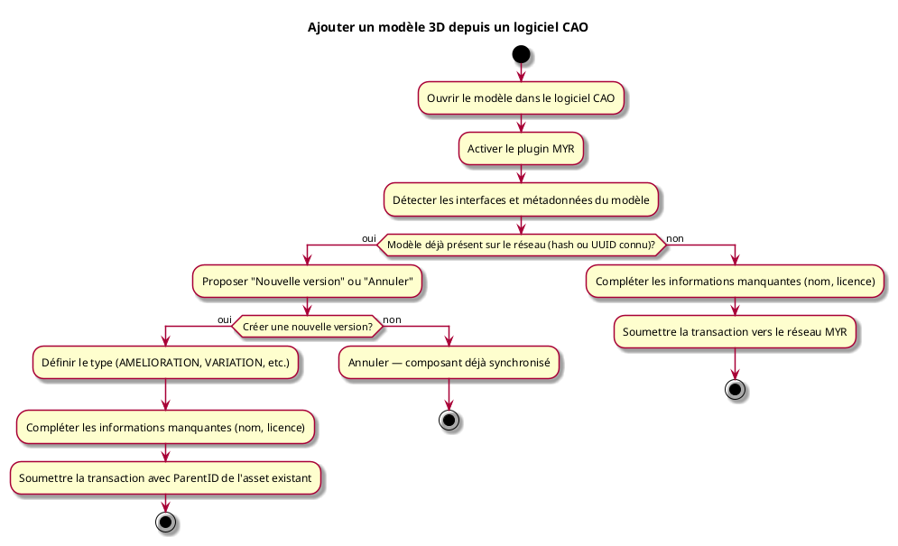

---
categorie: Automatisation
titre: "Ajouter un modèle 3D depuis un logiciel CAO"
probabilite: 5
impact: 2
importance: 10
etat: relire
---

# Ajouter un modèle 3D depuis un logiciel CAO

## Diagramme d'acteurs

## Contexte

L'utilisateur peut depuis son logiciel CAO (Fusion360, AutoCAD, SolidWorks...) intégrer ses composants directement dans un réseau dont il à un compte renseigné.

## Pré-conditions

- Plugin MYR pour logiciel CAO installé
- avoir un accès API au réseau MYR désiré.
- Modèle CAO ouvert dans le logiciel

## Scénario

**Étape initiale :** L'utilisateur ouvre son modèle dans le logiciel CAO

### Flux nominal — Intégration réussie

1. L'utilisateur active le plugin MYR dans le logiciel CAO
2. Le plugin détecte les interfaces et métadonnées du modèle
3. L'utilisateur complète les informations manquantes (nom, licence)
4. La transaction est soumise vers le réseau MYR connecté.

### Flux alternatif — Modèle déjà présent sur le réseau

1. Lors de l'intégration, le plugin détecte qu'un composant avec le même hash ou UUID existe déjà sur le réseau
2. Le système propose deux options :
   - Créer une nouvelle version (amélioration ou dérivation) du composant existant
   - Annuler l'envoi (le composant local est déjà synchronisé)
3. L'utilisateur choisit "Créer une nouvelle version"
4. Le type d'asset (AMELIORATION, VARIATION, etc.) est défini et la transaction est soumise avec le `ParentID` de l'asset existant

## Post-conditions

- Le composant est enregistré sur le réseau MYR connecté depuis le logiciel CAO

## Diagramme d'activités

