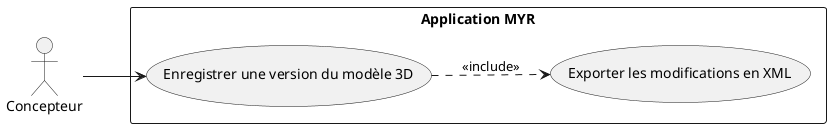
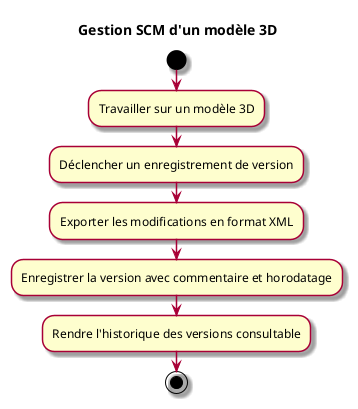

---
categorie: Automatisation
titre: "Gestion SCM d'un modèle 3D"
probabilite: 1
impact: 5
importance: 5
etat: relire
---

# Gestion SCM d'un modèle 3D

## Diagramme d'acteurs

## Contexte

L'utilisateur peut enregistrer par un format XML les modifications liées à un travail sur un modèle 3D (Source Control Management).

## Pré-conditions

- Être connecté au réseau
- Avoir un modèle 3D en cours d'édition

## Scénario

**Étape initiale :** L'utilisateur travaille sur un modèle 3D

### Flux nominal — Version enregistrée

1. L'utilisateur déclenche un enregistrement de version
2. Le système exporte les modifications en format XML
3. La version est enregistrée avec un commentaire et un horodatage
4. L'historique des versions est consultable

## Post-conditions

- Les modifications sont versionnées et exportables en XML
- L'historique des versions est traçable

## Diagramme d'activités

