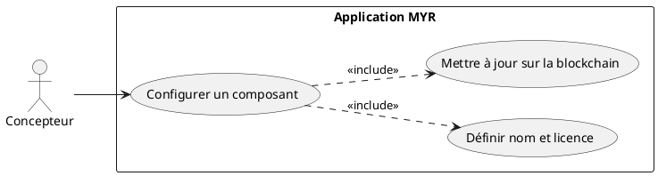
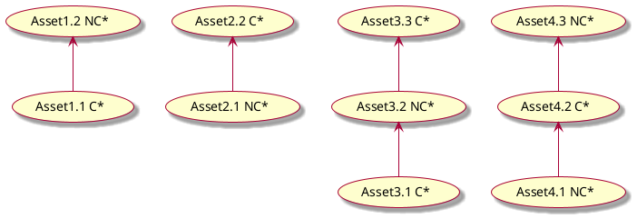
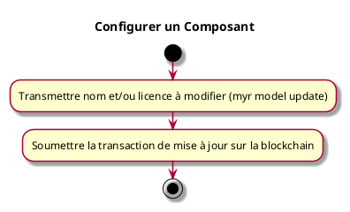

---
categorie: Composant Ecriture
titre: "Configurer un Composant"
probabilite: 3
impact: 5
importance: 15
etat: relire
---

# Configurer un Composant

## Diagramme d'acteurs

## Contexte

Un composant doit pouvoir être configuré selon un nom et une licence par son propriétaire.

## Pré-conditions

- Être connecté au réseau
- Être propriétaire du composant ou avoir les droits d'édition

## Scénario

**Étape initiale :** `myr model update <id> --name <nom> --license <id-licence>` est exécutée (ou l'appel API équivalent), pour le compte du propriétaire du composant

### Flux nominal — Configuration réussie

1. Le nom du composant est défini ou modifié
2. La licence applicable est sélectionnée ou renseignée
3. La transaction de mise à jour est soumise sur la blockchain — les règles de compatibilité de licence s'appliquent

## Post-conditions

- La configuration du composant est mise à jour sur le réseau
- Les informations de nom et licence sont visibles par les autres utilisateurs

## Diagrammes

### Héritage de licences Commercial (C) / Non-Commercial (NC) entre assets

- **C** = Commercial — **NC** = Non-Commercial
- Asset 1.1 est Commercial ; son dérivé 1.2 est Non-Commercial : la licence de 1.2 doit être compatible avec 1.1.
- Asset 2.1 est Non-Commercial mais est utilisé comme base d'un asset Commercial 2.2 : la licence de 2.2 doit être compatible avec 2.1.

### Diagramme d'activités

