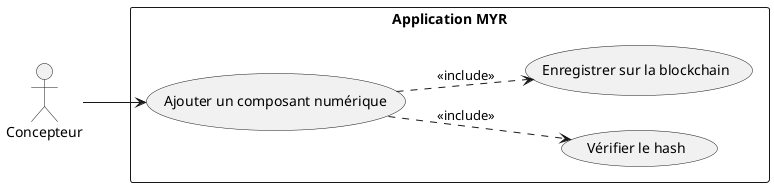
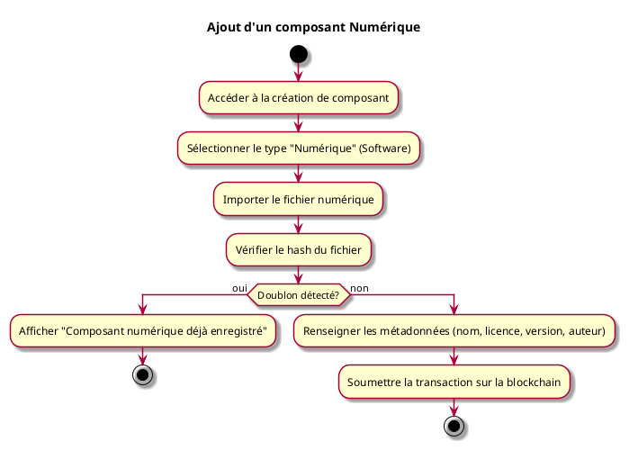

---
categorie: Composant Ecriture
titre: "Ajout d'un composant Numérique"
probabilite: 3
impact: 5
importance: 15
---

# Ajout d'un composant Numérique

## Diagramme d'acteurs

## Contexte

Ajout d'un élément numérique (logiciel, firmware, driver...) comme composant dans le système MYR.

## Pré-conditions

- Être connecté au réseau
- Avoir les droits de création de composants
- Disposer du fichier numérique à intégrer

## Scénario

**Étape initiale :** L'utilisateur accède à la création de composant

### Flux nominal — Composant numérique nouveau

1. L'utilisateur sélectionne le type "Numérique" (Software)
2. Il importe son fichier numérique
3. Le système vérifie le hash du fichier
4. L'utilisateur renseigne les métadonnées (nom, licence, version, auteur)
5. La transaction est soumise sur la blockchain

### Flux erreur — Doublon détecté

1. Erreur : "Composant numérique déjà enregistré"

## Post-conditions

- Le composant numérique est enregistré sur le réseau
- Un UUID unique lui est attribué

## Diagramme d'activités

