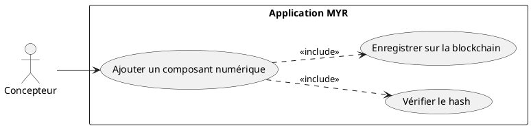
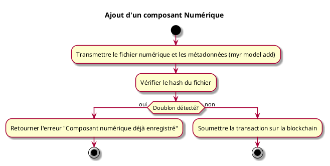

---
categorie: Composant Ecriture
titre: "Ajout d'un composant Numérique"
probabilite: 3
impact: 5
importance: 15
---

# Ajout d'un composant Numérique

## Diagramme d'acteurs

## Contexte

Ajout d'un élément numérique (logiciel, firmware, driver...) comme composant dans le système MYR.

## Pré-conditions

- Être connecté au réseau
- Avoir les droits de création de composants
- Disposer du fichier numérique à intégrer

## Scénario

**Étape initiale :** `myr model add firmware.bin --name "Firmware v2" --channel greenchannel --category base` est exécutée (ou l'appel API équivalent), pour le compte du Concepteur

### Flux nominal — Composant numérique nouveau

1. Le type "Numérique" (Software) est désigné
2. Le fichier numérique est importé
3. Le système vérifie le hash du fichier
4. Les métadonnées sont renseignées (nom, licence, version, auteur)
5. La transaction est soumise sur la blockchain

### Flux erreur — Doublon détecté

1. Erreur métier : "Composant numérique déjà enregistré" (RM01)

## Post-conditions

- Le composant numérique est enregistré sur le réseau
- Un UUID unique lui est attribué

## Diagramme d'activités

