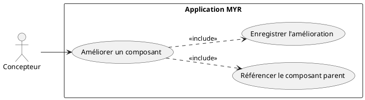
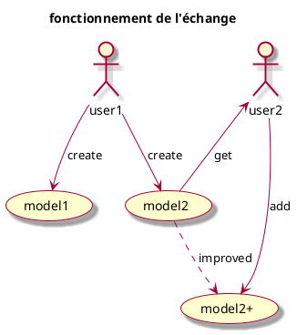
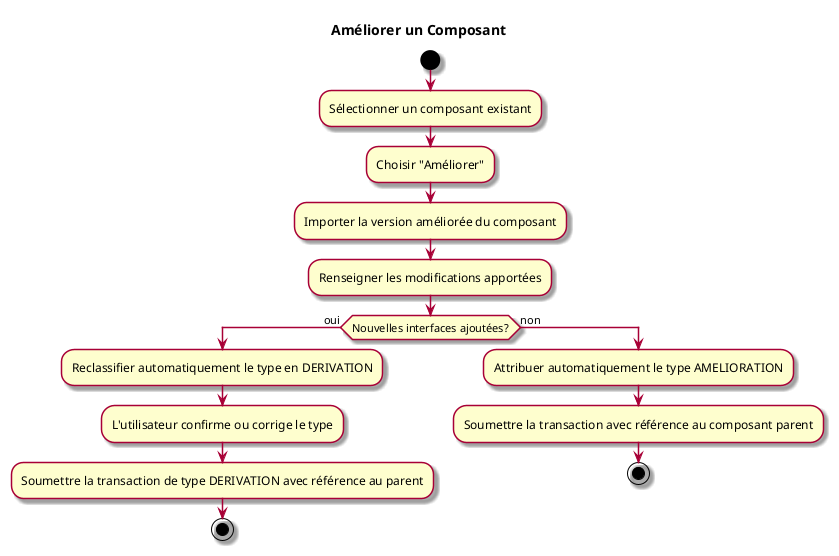

---
categorie: Composant Ecriture
titre: "Améliorer un Composant"
probabilite: 2
impact: 5
importance: 10
etat: relire
---

# Améliorer un Composant

## Diagramme d'acteurs

## Contexte

Un composant existant peut être amélioré (mêmes fonctionnalités mais renforcées) par un utilisateur autorisé. Il s'agit d'une AMELIORATION dans la taxonomie MYR.

## Pré-conditions

- Être connecté au réseau
- Avoir les droits d'amélioration sur le composant
- Composant de base existant sur le réseau

## Scénario

**Étape initiale :** L'utilisateur sélectionne un composant existant et choisit "Améliorer"

### Flux nominal — Amélioration réussie

1. Le type AMELIORATION est automatiquement attribué
2. L'utilisateur importe la version améliorée du composant
3. Il renseigne les modifications apportées
4. La transaction est soumise avec référence au composant parent

### Flux alternatif — Amélioration avec ajout d'interfaces

1. La version améliorée du composant introduit de nouvelles interfaces non présentes dans la version parente
2. Le système détecte l'ajout de fonctionnalités et signale que le type est reclassifié en DERIVATION
3. L'utilisateur confirme ou corrige le type retenu
4. La transaction est soumise avec le type final (DERIVATION) et la référence au composant parent

## Post-conditions

- Une nouvelle version améliorée du composant est enregistrée
- Elle est liée au composant parent via sa dépendance blockchain

## Diagrammes

### Cycle de vie — création, partage et amélioration d'un composant

### Diagramme d'activités

